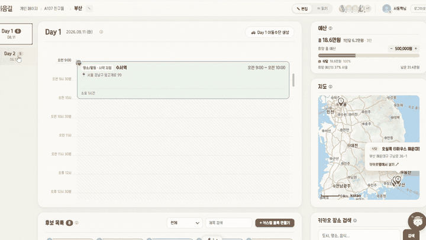
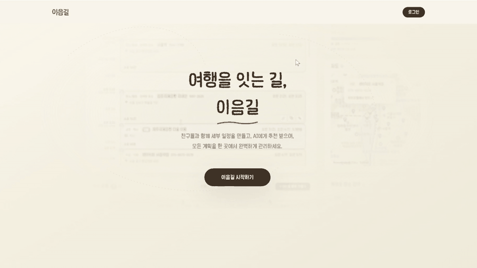
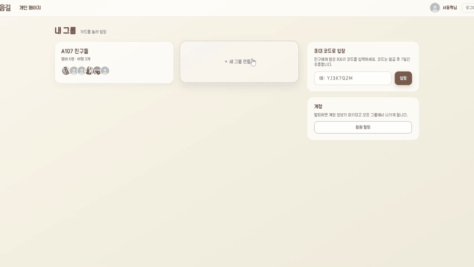
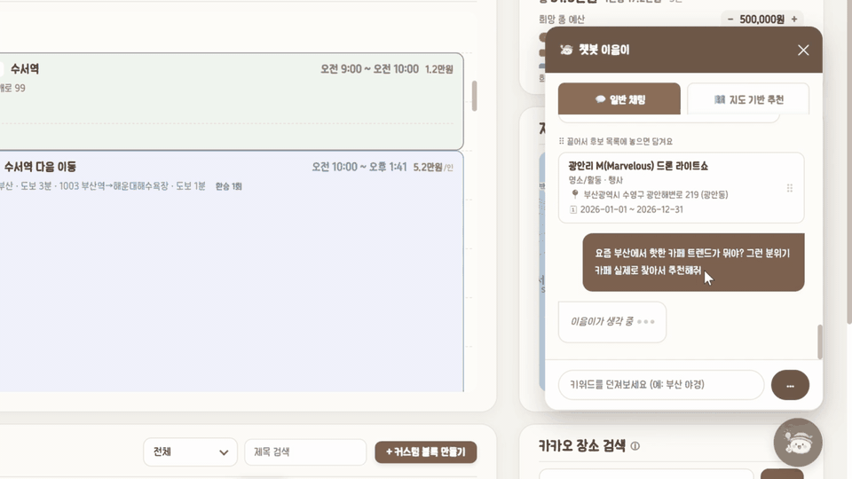
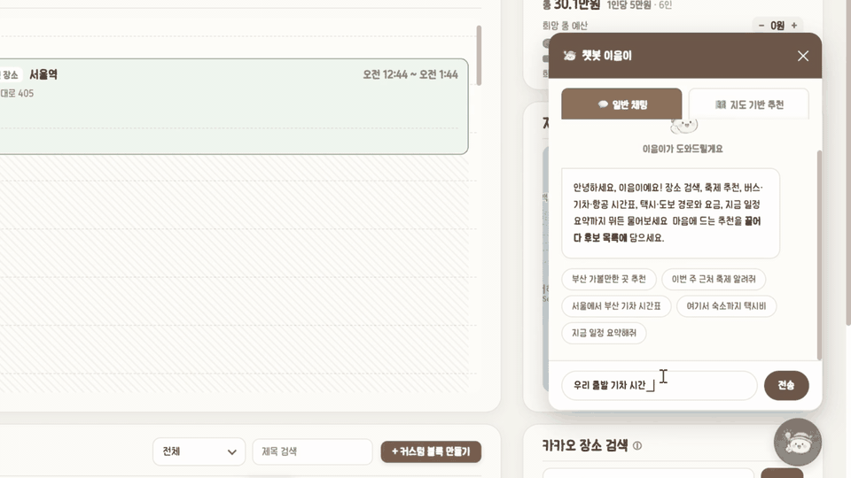
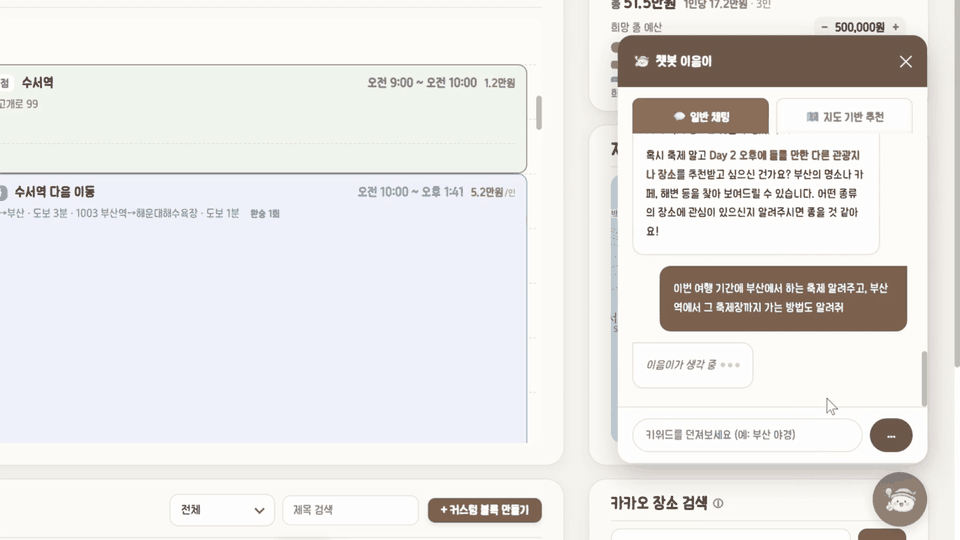
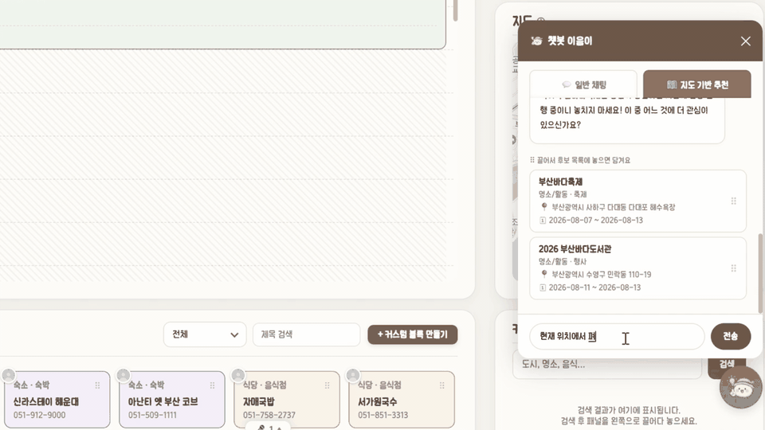
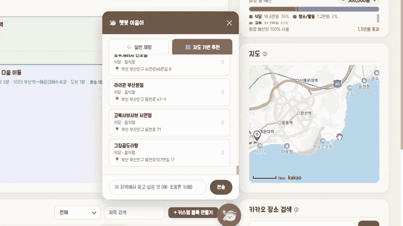
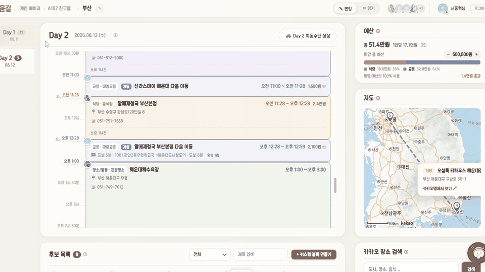

<div align="center">

# 이음길

**흩어진 계획을 하나의 길로 잇습니다**

메신저와 지도 앱을 오가는 대신, 팀 전체가 하나의 보드에서 함께 여행 일정을 짭니다.



<a href="https://drive.google.com/file/d/1vA0zFCZVCyGRHxmshQmdplJXF4VZhfX2/view?usp=sharing"></a>


6인 팀, 4주, 1주 단위 스프린트

</div>

---

## "우리 이제 어디 가?"

여행 중에 가장 자주 나오는 질문입니다. 계획을 세운 사람만 답을 알고 있기 때문입니다.


문제는 하나가 아니라 네 개가 사슬처럼 엮여 있습니다. **도구가 흩어져 있으니** 한 명이 의견을 모으게 되고, 그러다 보니 **계획이 한 사람에게 쏠립니다.** 결과물은 표 한 장이라 **한눈에 안 들어오고,** 현장에서 변수가 생겨도 **모바일로는 손댈 수가 없습니다.**

이음길은 이 사슬을 하나의 보드로 끊습니다. 일정 편집의 최소 단위를 표의 셀이 아니라 **눈에 보이는 여정 조각**으로 바꾸고, 그 조각을 참여자 전원이 동시에 만지게 했습니다.

---

## 화면으로 보는 흐름

### 1. 카카오 로그인, 그리고 초대코드로 입장



자체 회원가입을 만들지 않았습니다. 카카오 소셜 로그인만 두고, 그룹 참여는 초대코드 한 줄로 끝냅니다. 여행 계획은 보통 급하게 시작되기 때문에, 첫 화면에서 이탈할 이유를 최대한 없앴습니다.

### 2. 그룹을 만들고 프로젝트를 엽니다



**그룹**은 함께 다니는 사람들의 묶음이고, **프로젝트**는 그 사람들이 떠나는 한 번의 여행입니다. 같은 멤버로 여행을 여러 번 가는 경우가 많아서 두 층을 나눴습니다. 멤버를 매번 다시 초대하지 않아도 됩니다.

### 3. 챗봇에게 물어서 일정을 채웁니다

대시보드 안에 챗봇이 붙어 있습니다. Spring AI의 Tool Calling으로 실제 API를 호출하기 때문에, 모델이 지어낸 장소가 아니라 **조회된 데이터로 답합니다.**

<details open>
<summary><b>요즘 뭐가 유행인지 물어보기</b></summary>



</details>

<details>
<summary><b>지금까지 짠 일정을 읽고 이어서 추천받기</b></summary>



챗봇이 보드에 올라간 일정 조각을 읽습니다. "여기 다음에 갈 만한 곳"처럼 앞뒤 문맥이 필요한 질문에 답할 수 있습니다.

</details>

<details>
<summary><b>그 지역 축제 찾기</b></summary>



TourAPI에서 수집한 지역 축제 데이터를 배치로 쌓아 두고 조회합니다.

</details>

<details>
<summary><b>지도를 기준으로 검색하기</b></summary>



</details>

<details>
<summary><b>지도와 후기를 함께 보고 고르기</b></summary>



</details>

### 4. 완성된 일정은 읽기 모드로



여행 당일에 필요한 건 편집이 아니라 조회입니다. 편집 UI를 걷어내고 순서, 이동 시간, 예산만 남긴 화면을 따로 뒀습니다.

---

## 무엇을 다르게 만들었나

| | 기존 여행 계획 서비스 | 이음길 |
| --- | --- | --- |
| **협업 편집** | 실시간 동기화 | 실시간 동기화 + 라이브 커서 + 보이스 채팅 |
| **의견 조율** | 별도 메신저 필요 | 보드 안에서 음성으로 |
| **일정 표현** | 표 또는 리스트 | 일정 체인 UI, 이동 시간 자동 계산 |
| **국내 장소** | 해외 지도 기반이라 데이터가 얕음 | 카카오 기반 API로 국내 정보 확보 |

가장 큰 차이는 계획 단계 그 자체입니다. 한 명이 정리해서 공유하는 방식이 아니라, **참여자 전원이 같은 보드에서 동시에 만들어 갑니다.**

## 주요 기능

| 기능 | 설명 |
| --- | --- |
| **일정 체인 편집** | 드래그 앤 드롭으로 일자별 일정을 구성하고 수정 |
| **카카오맵 연동** | 장소 검색 결과를 클릭하면 일정 조각이 자동 생성되고 경로가 표시 |
| **AI 추천 챗봇** | 키워드 한 줄로 후보 일정을 받아 보드에 바로 배치 |
| **실시간 공동 편집** | 동시 편집, 접속자 상태와 라이브 커서 표시 |
| **보이스 채팅** | 보드를 함께 보면서 음성으로 소통, 발화자 표시 |
| **예산 관리** | 일정별 예상 비용 합산, 인당 달성률 시각화와 초과 알림 |
| **스마트 시간 계산** | 이동 시간을 포함한 소요 시간 자동 계산 |

---

## 기술 스택

| 영역 | 사용 기술 |
| --- | --- |
| **백엔드** | Java 21, Spring Boot 3.4 (Web / Data JPA / Security / Validation / AOP), Spring AI 1.1, PostgreSQL 16, Redis 7 |
| **프론트엔드** | React 19, Vite 8, Zustand, dnd-kit, fractional-indexing, React Router 7, Axios |
| **실시간 통신** | WebSocket + STOMP, 인프로세스 SimpleBroker 기반 오퍼레이션 브로드캐스트 |
| **음성 통신** | WebRTC P2P mesh (6인 권장, 상한 미적용) |
| **AI 챗봇** | Spring AI + Anthropic Claude (claude-haiku-4-5), Tool Calling 기반 축제/장소 추천 |
| **인프라** | Amazon EC2, Docker Compose, Nginx 1.27 (SPA 정적 서빙) |
| **인증** | Kakao OAuth 2.0, JWT (jjwt 0.12) |
| **문서 / 테스트** | springdoc-openapi (Swagger UI), JUnit 5, Testcontainers (PostgreSQL) |
| **외부 API** | Kakao Maps SDK, Kakao Local, Kakao Mobility(도보·차량 길찾기), ODsay(대중교통·시간표), TourAPI(지역 축제), 오피넷(유가), Anthropic |

## 실시간 동기화를 어떻게 맞췄나

여러 사람이 같은 보드를 동시에 만지는 서비스입니다. 이 프로젝트에서 시간을 가장 많이 쓴 곳은 기능 추가가 아니라 **동시성**이었습니다.

<details>
<summary><b>왜 상태가 아니라 오퍼레이션을 보내는가</b></summary>

<br/>

가장 쉬운 구현은 편집한 사람이 **바뀐 보드 전체를 서버에 저장하고 남에게 뿌리는 것**입니다. 그런데 두 사람이 거의 같은 순간에 저장하면, 나중에 도착한 쪽이 앞사람의 변경을 통째로 덮습니다. 없어진 변경이 어디서 사라졌는지도 알 수 없습니다.

그래서 "지금 보드는 이렇다"가 아니라 **"블록 3을 2일차 두 번째로 옮겼다"** 같은 **연산(op)** 을 보냅니다. 연산은 작아서 겹치는 범위가 좁고, 순서만 정해지면 결과가 하나로 수렴합니다.

순서를 정하는 주체는 **서버 하나**로 못박았습니다. 클라이언트가 각자 순서를 정하면 화면마다 다른 결론이 나옵니다.

</details>

<details>
<summary><b>전역 순서 — Redis INCR로 시퀀스 발급</b></summary>

<br/>

op가 도착할 때마다 Redis `INCR`로 번호를 매깁니다. 이 번호가 **유일한 진실**입니다.

`INCR`을 쓴 이유는 **원자성**입니다. "현재 값을 읽고 1을 더해 저장한다"를 애플리케이션에서 하면, 두 요청이 같은 값을 읽어 같은 번호를 받는 경합이 생깁니다. Redis의 `INCR`은 이 읽기와 쓰기를 서버 쪽에서 한 동작으로 처리하므로 중간에 끼어들 틈이 없습니다.

번호가 붙으면 클라이언트는 **자기가 어디까지 받았는지**를 숫자 하나로 표현할 수 있습니다. 이게 아래의 유실 복구와 스냅샷 진입을 가능하게 하는 전제입니다.

</details>

<details>
<summary><b>커밋 이후에만 방송 — AFTER_COMMIT</b></summary>

<br/>

처음에는 서비스 로직에서 DB에 쓰고 바로 브로드캐스트했습니다. 문제는 **그 뒤에 트랜잭션이 롤백될 수 있다**는 점입니다. 롤백되면 서버 DB에는 변경이 없는데 다른 사람 화면에는 남습니다. 새로고침하면 사라지는, 재현이 까다로운 유령 상태가 됩니다.

그래서 방송 시점을 트랜잭션 `AFTER_COMMIT`으로 옮겼습니다. **커밋이 확정된 변경만 밖으로 나갑니다.**

같은 이유로 경로마다 갈려 있던 `publish → mutate`와 `mutate → publish` 순서도 한 방향으로 통일했습니다.

</details>

<details>
<summary><b>본인 op가 되돌아오는 문제 — X-Client-Id</b></summary>

<br/>

브로드캐스트는 접속자 전원에게 갑니다. 보낸 사람도 포함입니다. 그러면 이런 일이 벌어집니다.

1. 내가 블록을 드래그하면 화면이 먼저 그려집니다 (응답을 기다리면 손이 굼떠 보입니다)
2. 서버가 처리한 뒤 같은 op를 나에게도 방송합니다
3. 이미 그려진 위치에 같은 변경이 한 번 더 적용되며 화면이 깜빡입니다

요청에 `X-Client-Id` 헤더를 실어 보내고, 방송할 때 **그 클라이언트만 건너뜁니다.** 사용자 단위가 아니라 클라이언트 단위인 이유는, 같은 사람이 두 탭을 열어 두면 다른 탭에서는 반영되어야 하기 때문입니다.

</details>

<details>
<summary><b>끊겼다 붙었을 때 — 유실 op 재전송</b></summary>

<br/>

WebSocket은 끊깁니다. 지하철에서 터널을 지나면 끊기고, 노트북 덮으면 끊깁니다. 끊긴 사이에 방송된 op는 그냥 사라집니다.

클라이언트가 **마지막으로 받은 시퀀스**를 기억하고 있으니, 재접속할 때 그 번호를 서버에 알려 **빠진 구간만 다시 받습니다.** 처음부터 다시 받거나 새로고침을 강요하지 않아도 됩니다.

이게 성립하려면 op가 기록으로 남아 있어야 해서, op 파이프라인은 방송만 하는 게 아니라 **기록도 함께** 합니다.

</details>

<details>
<summary><b>처음 들어올 때 — 스냅샷과 lastSeq의 읽기 순서</b></summary>

<br/>

새로 접속한 사람에게 op를 1번부터 재생시킬 수는 없습니다. 현재 상태를 한 번에 주는 **스냅샷 API**를 뒀습니다.

여기에 함정이 하나 있었습니다. 스냅샷과 `lastSeq`를 각각 조회하는데, **읽는 순서에 따라 구멍이 생깁니다.**

- 스냅샷을 먼저 읽고 `lastSeq`를 나중에 읽으면, 그 사이에 처리된 op가 스냅샷에는 없는데 `lastSeq`에는 포함됩니다. 클라이언트는 그 op를 받은 줄 알고 넘어가므로 **영구히 유실**됩니다
- 순서를 뒤집으면 반대가 됩니다. 그 사이 op가 스냅샷에는 반영되어 있고 `lastSeq`에는 없으므로, 클라이언트가 그 op를 **한 번 더 받습니다**

두 경우 모두 완벽하지 않지만 **성격이 다릅니다.** 유실은 복구할 수 없고, 중복 적용은 같은 연산을 두 번 해도 결과가 같게 만들면 됩니다. 그래서 조회 순서를 역전시켜 **중복이 나는 쪽을 택했습니다.**

</details>

<details>
<summary><b>같은 값을 동시에 고칠 때 — 필드 단위 LWW</b></summary>

<br/>

두 사람이 같은 블록을 열고 한 명은 제목을, 한 명은 메모를 고쳤습니다. 엔티티 전체를 저장하면 나중 쓰기가 **자기가 건드리지 않은 필드까지** 예전 값으로 되돌립니다.

변경된 필드만 반영하도록 바꿔 **행 단위 덮어쓰기로 인한 유실**을 막았습니다. 같은 필드를 동시에 고친 경우에만 마지막 쓰기가 이깁니다.

</details>

<details>
<summary><b>하나의 상세 화면을 동시에 편집할 때 — 편집 락</b></summary>

<br/>

필드 단위 병합으로 해결되지 않는 것도 있습니다. 상세 화면처럼 여러 값을 함께 고치는 편집은, 중간 상태가 남의 편집과 섞이면 앞뒤가 안 맞습니다.

- 누가 상세를 열면 **락**을 쥐고, 다른 멤버의 상세 쓰기는 `409`로 거부합니다
- 락에는 **만료**를 뒀습니다. 편집자가 창을 닫지 않고 이탈해도 그 블록이 영구히 잠기지 않습니다
- 프론트에서 버튼을 비활성화하는 것만으로는 API를 직접 호출하는 경로가 남습니다. 쓰기 직전에 서버가 `isLockedByOther`로 다시 확인합니다
- 단, 락과 무관한 필드는 통과시킵니다. 락 하나로 블록의 모든 수정을 막으면 실제 사용에서 답답합니다

</details>

<details>
<summary><b>순서를 어떻게 표현하는가 — fractional-indexing</b></summary>

<br/>

블록 순서를 1, 2, 3 정수로 두면 **사이에 하나 끼워 넣을 때 뒤따르는 블록 전체의 번호를 다시 매겨야** 합니다. 그러면 op 하나가 수십 개 블록을 건드리고, 동시 삽입이 서로를 계속 밀어냅니다.

`fractional-indexing`은 순서를 정렬 가능한 문자열로 표현해 **두 값 사이에 항상 새 값을 만들 수 있게** 합니다. 삽입이 주변 블록을 건드리지 않으므로 동시 삽입이 충돌하지 않습니다.

</details>

<details>
<summary><b>락 순서 역전과 데드락</b></summary>

<br/>

실시간 op와 도메인 API가 같은 자원을 잠그는데 **획득 순서가 경로마다 달랐습니다.** 한쪽이 A를 잡고 B를 기다리는 동안 다른 쪽이 B를 잡고 A를 기다리면 둘 다 영원히 멈춥니다.

두 단계로 처리했습니다.

- **증상 차단** — op 락 획득에 `tryLock` 상한을 뒀습니다. 교착이 생겨도 대기가 무한정 늘지 않고 해당 요청만 실패합니다. 하나의 교착이 커넥션 풀을 잠식해 전체 장애로 번지는 것을 먼저 끊었습니다
- **원인 제거** — publish 진입 시 flush를 먼저 수행해 **'DB 행 락 → 프로젝트 락' 한 방향으로 통일**했습니다

데드락은 순환 대기에서 생깁니다. 그래서 **타임아웃은 완화이고 순서 고정이 해결**입니다. 둘 다 남긴 이유는, 앞으로 추가되는 경로가 순서를 어겼을 때 상한이 안전망으로 남기 때문입니다.

</details>

<details>
<summary><b>실시간 채널의 인증은 따로 샌다</b></summary>

<br/>

HTTP 요청은 매번 토큰을 검사합니다. WebSocket은 **한 번 연결되면 계속 열려 있습니다.** 생명주기가 달라서 인증이 새는 지점이 생겼습니다.

- **접속 중 만료** — 접속 시점에 유효했던 토큰이 도중에 만료되어도 세션은 살아 있습니다. 탈퇴하거나 로그아웃한 뒤에도 실시간 수신이 이어졌습니다. 인터셉터는 새로 들어오는 프레임만 보므로 **이미 열린 세션을 닫을 수 없습니다.** 만료된 세션을 주기적으로 훑어 닫는 스위퍼를 뒀습니다
- **목적지 위조** — STOMP `SEND`를 `/app` 목적지로만 허용했습니다. 제한이 없으면 클라이언트가 브로커 목적지로 직접 발행해 **op를 위조하거나 남의 개인 큐로 우회**할 수 있습니다
- **시그널 대상 미검증** — 보이스 채팅 시그널링에서 대상을 확인하지 않아 프로젝트 멤버가 아닌 상대에게도 오퍼가 갈 수 있었습니다

</details>

<details>
<summary><b>목으로는 재현되지 않는다 — 실제 컨테이너 테스트</b></summary>

<br/>

위의 문제들은 대부분 **타이밍**에서 나옵니다. 목(mock)으로는 재현되지 않습니다. Testcontainers로 실제 PostgreSQL과 Redis를 띄워 검증했습니다.

- 편집 락의 경합, 소유권, 만료
- 남의 락이 걸린 상태에서 상세 쓰기가 `409`로 막히는지, 락과 무관한 필드는 통과하는지
- 세션이 만료되면 닫히는지, 만료 전에는 유지되는지, `CONNECT` 전 세션은 건너뛰는지, 하나를 닫다 실패해도 나머지 스윕이 계속되는지
- 2인 그룹에서 동시에 탈퇴했을 때 멤버 없는 그룹이 남지 않는지
- 인가, 시퀀스 리시드, 블록의 후보 목록 이동

</details>

<details>
<summary><b>지금 구조의 한계</b></summary>

<br/>

브로커는 Spring의 **인프로세스 SimpleBroker**입니다. 애플리케이션 메모리 안에서 방송을 처리하므로 별도 미들웨어가 필요 없고 지연도 짧습니다.

대신 **서버 인스턴스가 하나라는 전제**가 깔려 있습니다. 인스턴스를 늘리면 A 서버에 붙은 사용자의 op가 B 서버에 붙은 사용자에게 가지 않습니다. 스케일아웃하려면 Redis나 RabbitMQ를 릴레이로 두는 구조로 바꿔야 합니다. 6인 팀 단위 협업이라는 사용 규모에서는 단일 인스턴스로 충분하다고 판단해 이 선택을 유지했습니다.

</details>

---

## 프로젝트 구조

```
ieumgil/
├── backend/                  Spring Boot 애플리케이션
│   ├── src/main/java/com/ssafy/ieumgil/
│   │   ├── domain/
│   │   │   ├── auth/         카카오 OAuth 로그인, JWT 발급
│   │   │   ├── user/         사용자 정보
│   │   │   ├── group/        그룹 관리, 멤버 초대/탈퇴
│   │   │   ├── project/      프로젝트(여행), 예산 관리
│   │   │   ├── block/        일정 조각(블록) CRUD, 체인 정렬
│   │   │   ├── place/        카카오 장소 검색, 길찾기(Kakao Mobility)
│   │   │   ├── transit/      대중교통 경로/시간표(ODsay), 유가(오피넷)
│   │   │   ├── festival/     지역 축제 데이터(TourAPI) 배치 수집
│   │   │   ├── chatbot/      Spring AI 기반 일정 추천 챗봇
│   │   │   └── activitylog/  프로젝트 활동 로그
│   │   └── global/
│   │       ├── websocket/    STOMP 설정, 접속자(Presence) 관리
│   │       ├── realtime/     오퍼레이션 시퀀싱(Redis INCR), AFTER_COMMIT 브로드캐스트
│   │       └── security/     JWT 인증 필터, 시큐리티 설정
│   └── docker/               PostgreSQL/Redis 커스텀 이미지, 마이그레이션 SQL
├── frontend/                 React SPA (Vite)
│   └── src/
│       ├── pages/            Landing, Auth, My, Group, Dashboard
│       ├── features/
│       │   ├── auth/ my/ group/ place/
│       │   └── dashboard/    핵심 작업 공간
│       │       ├── realtime/ 실시간 공동 편집 (오퍼레이션 시퀀서)
│       │       ├── voice/    WebRTC 보이스 채팅
│       │       └── map/      카카오맵 연동
│       └── global/           공용 API 클라이언트, 스토어, 컴포넌트
├── docker-compose.prod.yml   EC2 운영 스택 (frontend + backend + postgres + redis)
└── docs/                     API 명세, ERD, 배포 가이드, 실시간 동기화 정책
```

---

## 팀

<table>
<thead>
<tr><th width="90"></th><th>이름</th><th>역할</th><th>담당</th><th>이메일</th></tr>
</thead>
<tbody>
<tr>
  <td align="center"><a href="https://github.com/LSe-Yeong"></a></td>
  <td align="center"><b>이세영</b></td>
  <td align="center">Frontend<br/>Infra</td>
  <td>일정 체인 드래그 앤 드롭 UI, 프론트엔드 총괄<br/>EC2 운영 스택 구성 (docker-compose)</td>
  <td>ocdee39@gmail.com</td>
</tr>
<tr>
  <td align="center"></td>
  <td align="center"><b>김광민</b></td>
  <td align="center">Frontend</td>
  <td>카카오맵 연동, 장소 검색과 경로 시각화</td>
  <td>rhkd3als9@naver.com</td>
</tr>
<tr>
  <td align="center"></td>
  <td align="center"><b>이연호</b></td>
  <td align="center">Frontend</td>
  <td>마이페이지와 그룹페이지 UI, 예산 시각화 차트</td>
  <td>alyssa8155@naver.com</td>
</tr>
<tr>
  <td align="center"></td>
  <td align="center"><b>서동혁</b></td>
  <td align="center">Backend</td>
  <td>백엔드 전반</td>
  <td>ehdgurdusdn@gmail.com</td>
</tr>
<tr>
  <td align="center"><a href="https://github.com/prgmd"></a></td>
  <td align="center"><b>장준환</b></td>
  <td align="center">Backend<br/>Infra</td>
  <td>백엔드 전반<br/>Docker 컨테이너화, EC2 배포 환경</td>
  <td>neon9008@gmail.com</td>
</tr>
<tr>
  <td align="center"><a href="https://github.com/CheonKiO"></a></td>
  <td align="center"><b>천기오</b></td>
  <td align="center">AI<br/>FullStack</td>
  <td>LLM 기반 추천 챗봇 API 연동, WebRTC 보이스 채팅, PostgreSQL과 Redis 컨테이너 이미지</td>
  <td>heelun8525@naver.com</td>
</tr>
</tbody>
</table>
