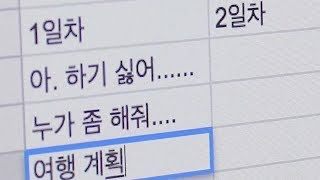

# 이음길

> **흩어진 계획을 하나의 길로 잇습니다**
>
> 메신저와 지도 앱을 오가는 대신, 팀 전체가 하나의 보드에서 함께 여행 일정을 짭니다.

| **항목** | **내용** |
| --- | --- |
| **문서** | 프로젝트 개요 |
| **작성일** | 2026. 07. 15 |
| **개발 기간** | 4주 (1주 단위 스프린트) |

## 1. 서비스 소개

**여행 협업 플랫폼.** 함께 여행하는 사람들이 같은 보드에서 일정을 **조각**으로 이어 붙이며 하나의 여행 계획을 완성합니다.

메신저와 스프레드시트를 오가며 계획을 전담해야 했던 모임의 주최자에게, 일정을 직관적으로 조립할 수 있는 공동의 보드를 제공합니다.

이름의 의미처럼, 사람과 사람을 **잇고** 함께 걸어갈 여정의 길을 만들어갑니다.

## 2. 기획 배경



> **"우리 이제 어디 가?"**
>
> — 여행 과정에서 가장 자주 듣게 되는 질문

기존의 여행 계획 과정에서는 다음의 다섯 가지 불편함이 반복적으로 발생합니다.

| **번호** | **문제점** | **주요 발생 상황** |
| --- | --- | --- |
| **01** | **분산된 도구** | 문서 도구, 메신저, 지도 앱 등을 복잡하게 오가며 일정을 계획합니다. |
| **02** | **계획의 편중** | 특정 인원이 계획을 전담하게 되고, 나머지 인원은 수동적으로 참여합니다. |
| **03** | **낮은 가독성** | 표 형태의 일정표는 한눈에 파악하기 어렵고 직관성이 떨어집니다. |
| **04** | **수정의 번거로움** | 여행 중 변수가 생겼을 때, 기존 계획표를 모바일에서 수정하기가 매우 어렵습니다. |

이러한 문제들은 개별적으로 발생하지 않습니다. **도구가 분산되어(01) 한 명이 의견을 취합하게 되고(02), 그 결과물이 표 형태라 가독성이 떨어지며(03), 현장에서 수정이 어려운(04)** 연쇄적인 구조를 가집니다.

## 3. 해결 방안 — 흩어진 계획을 하나의 보드로 잇다

- **직관적인 일정 시뮬레이션:** 일정 편집의 최소 단위는 텍스트 셀이 아닌 시각화된 여정 조각입니다. 조각을 자유롭게 배치하며 일정을 구성할 수 있습니다.
- **자동 시간 및 예산 계산:** 교통편 역시 여정 조각에 포함되어, 전체 이동 시간과 예상 소요 비용이 순서에 따라 자동 재계산됩니다.
- **보류 기능 지원:** 삭제 대신 '후보 목록'에 일정을 보류해 둘 수 있어 언제든 다시 활용할 수 있습니다.

## 4. 핵심 접근 방식

### ① 분산된 도구 → **통합된 단일 보드**

지도, 챗봇 추천, 예산 관리, 음성 채팅이 대시보드 화면 하나에 모두 통합되어 있습니다. 원하는 장소를 발견하면 클릭 한 번으로 여정 조각이 생성되므로 **다른 앱으로 옮겨 적는 번거로운 과정이 생략됩니다.**

### ② 계획의 편중 → **공동 편집과 직관적인 소통**

참여자 전원이 같은 보드를 동시에 제어합니다. 누군가 조각을 이동하면 실시간으로 동기화되며, 접속 중인 멤버의 위치가 **라이브 커서와 아바타**로 표시됩니다.

또한 의견 조율 시 **보이스 채팅**을 통해 화면을 보며 즉각적으로 소통할 수 있습니다.

### ③ 낮은 가독성 → **일정 체인 시스템**

일정은 `09:07 KTX 탑승 → 12:30 점심 식사 → 14:30 해변 산책`과 같이 순서대로 이어진 시각적 체인 형태로 제공됩니다.

각 조각의 예상 소요 시간을 기반으로 **다음 일정의 시작 시각과 최종 종료 예상 시각이 실시간으로 화면에 안내됩니다.**

### ④ 수정의 번거로움 → **유연한 현장 대처**

현지 기상 악화 등으로 일정을 전면 수정해야 할 때도 **간단한 드래그 앤 드롭**만으로 충분합니다. 일정을 추가하면 이후 일정이 자동으로 미뤄지고, 제외하면 체인이 알아서 다시 연결됩니다.

## 5. 주요 기능 명세

| **순번** | **기능명** | **기능 설명** | **해결 과제** |
| --- | --- | --- | --- |
| 1 | **일정 체인 편집** | 드래그 앤 드롭 방식으로 일자별 일정을 직관적으로 구성 및 수정 | ③, ④ |
| 2 | **카카오맵 연동** | 장소 검색 결과 클릭 시 일정 조각 자동 생성 및 경로 표시 | ① |
| 3 | **AI 추천 챗봇** | 키워드 입력 시 맞춤형 후보 일정 추천 및 간편 배치 지원 | ①, ② |
| 4 | **실시간 공동 편집** | 다수 사용자 동시 편집 지원, 접속자 상태 및 라이브 커서 시각화 | ② |
| 5 | **보이스 채팅** | 보드 화면을 공유하며 실시간 음성 소통 지원 (발화자 표시) | ② |
| 6 | **예산 관리 시스템** | 일정별 예상 비용 자동 합산, 인당 예산 달성률 시각화 및 초과 알림 | ③ |
| 7 | **스마트 시간 계산** | 이동 시간을 포함한 소요 시간 자동 계산 및 예상 일정 시각 안내 | ③, ④ |

## 6. 전체 화면 구성 및 흐름

```
①  메인 페이지         카카오·네이버 소셜 로그인 (자체 회원가입 절차 생략)
        ↓
②  마이 페이지         소속 그룹 목록 조회, 생성, 수정 및 삭제
        ↓
③  그룹 페이지         진행 중인 프로젝트 목록, 멤버 초대 및 방출
        ↓
④  프로젝트 대시보드    핵심 작업 공간 (일정 조각, 챗봇, 지도, 예산, 보이스 통합)
```

**자체 회원가입 없는 소셜 로그인 전용 시스템**을 채택하여 사용자의 인증 부담을 줄이고 서비스 접근성을 높였습니다.

서비스의 모든 핵심 경험은 **④ 프로젝트 대시보드** 내에서 이루어지며, 다른 화면들은 대시보드로의 진입을 돕거나 결과물을 시각화하는 역할을 수행합니다.

## 7. 기존 서비스와의 차별점

| **구분** | **기존 여행 계획 서비스** | **이음길** |
| --- | --- | --- |
| **협업 편집** | 실시간 동기화 지원 | 실시간 동기화 + **라이브 커서 및 보이스 채팅 결합** |
| **의견 조율** | 별도 메신저 활용 필요 | **보이스 채팅**을 통한 자체 의견 조율 |
| **일정 표현** | 가독성이 낮은 표 또는 리스트 형태 | **일정 체인 UI**를 통한 직관적 표현 및 시간 자동 계산 |
| **국내 데이터** | 해외 지도 기반으로 국내 장소 데이터 부족 | **카카오 기반 API** 활용으로 국내 장소 정보의 높은 정확도 확보 |

가장 큰 차별점은 계획 단계 그 자체에 있습니다. 한 명이 정리해서 공유하는 기존 방식과 달리, **이음길은 참여자 전원이 하나의 보드에서 동시에 일정을 만들어가는 협업 경험**을 지향합니다.

## 8. 기술 스택

| **영역** | **사용 기술 및 환경** |
| --- | --- |
| **백엔드** | Spring Boot, PostgreSQL, Redis |
| **프론트엔드** | React, JavaScript |
| **실시간 통신** | WebSocket, STOMP |
| **음성 통신** | WebRTC (P2P 통신, 최대 6인 동시 지원) |
| **인프라 환경** | Amazon EC2, Docker |
| **인증 및 보안** | Social OAuth 2.0 (Kakao, Naver), JWT |
| **외부 연동 API** | Kakao Maps SDK, Kakao Local API, Kakao Mobility(도보·차량 길찾기), ODsay(대중교통 길찾기 + 기차·버스·항공 시간표), TourAPI(지역 축제), 오피넷(유가), LLM API |

## 9. 팀 구성

총 **6명**으로 구성됨

### 영역별 담당

| **영역** | **담당자** |
| --- | --- |
| **Frontend** | 이세영, 김광민, 이연호 |
| **Backend** | 서동혁, 장준환 |
| **Infra** | 이세영, 장준환 |
| **AI · FullStack** | 천기오 |
