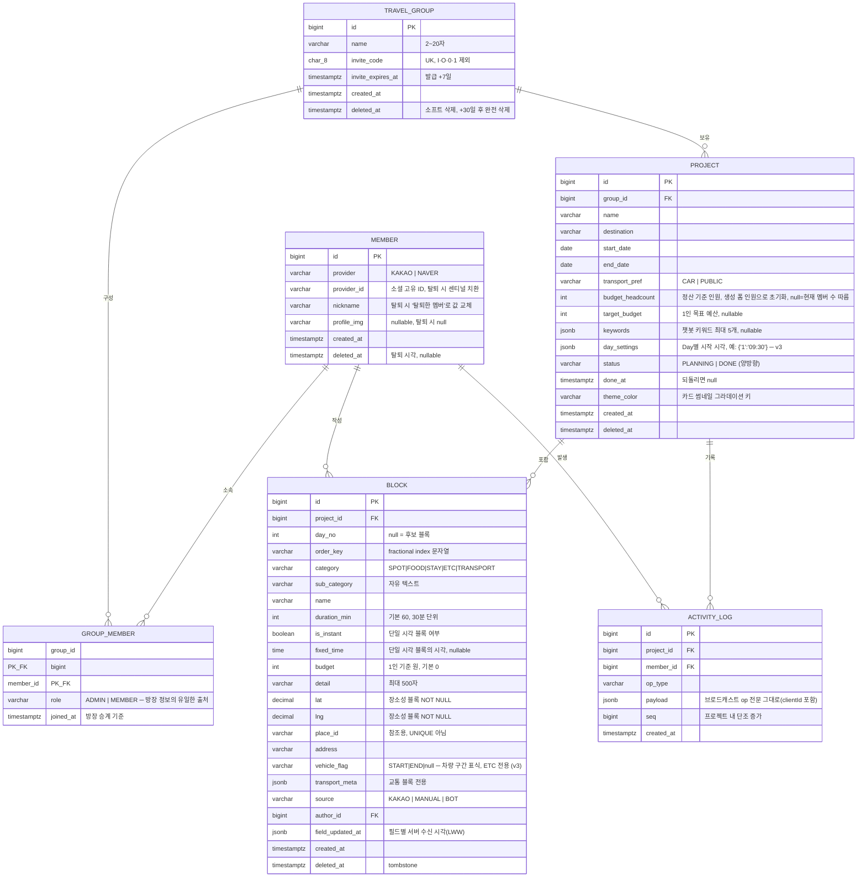

# 이음길 — 백엔드 설계 문서 v3 (ERD · API 명세 · 기술 스택 · 일정)

> 기준: 기능명세서 2026-07-16 / 통합 프로토타입
> 스택: Spring Boot 3.x + React / PostgreSQL(RDS) + Redis / EC2 + Docker
> ※ 명세서 NFR-06에는 MySQL로 표기돼 있으나, PostgreSQL(RDS) 전환 기준으로 작성. 차이는 JSON → **JSONB** 정도이며 나머지는 동일하게 호환된다.

## v3 변경 이력 (팀 리뷰 안건 반영)

| # | 안건 | 결정 | 반영 위치 |
|---|---|---|---|
| 12 | ① 차량 이용 구간 전환 | **길찾기 블록에 자차(CAR) 모드 추가**로 표현력 문제를 해결하고, `block.vehicle_flag`(START/END, ETC 전용)는 **수단 선택의 기본값 제안 용도로만** 사용 — 판정 결과를 계산에 직접 쓰지 않으므로 플래그가 어긋나도 계산이 오염되지 않음. `/api/transit/route`의 mode는 항상 클라이언트가 확정해 전송(기타 확인 4번 답변). 자차 소요 시간은 v1 하버사인×평균속도, 카카오모빌리티 연동은 여유 시 | §1-2 block, §2-5 |
| 13 | ② DAY 시작 시각 저장 | **B안 — `project.day_settings` JSONB** 채택. DAY-03은 권장 우선순위 + Day 메타데이터가 현재 시작 시각 하나뿐 + trip_day 테이블은 행 라이프사이클(생성 시점·기간 축소 정리·신규 엔티티 op)이 따라오므로 v1은 JSONB. Day 메모·색상 등 메타데이터가 늘어나는 시점에 A안(trip_day)으로 마이그레이션 | §1-2 project, §2-3 |
| 14 | ③ 교통 요금 신뢰도 | `transport_meta.fareConfidence`(`CONFIRMED`\|`ESTIMATE`) 추가 — 소요 시간 추정(`estimated`)과 별개 축. 항공·수동 입력은 ESTIMATE, 택시 산식도 ESTIMATE. "확정 예약 전 실제 사이트 확인 필요" 공통 안내 문구 채택 | §1-2 block, §2-5 |
| 15 | ④ 예산 입력 UX | **B안 — 입력 UI 총액/1인 토글, 저장은 1인 기준 반올림 정수**로 통일(스키마 변경 없음). 총액 입력 블록은 표시도 반올림 단위로 정리해 역산 오차(99,999원 표기)로 인한 버그 오인 방지 | §1-2 block, §3 FE |
| 16 | 기타 확인 | keywords는 재입력 가능(BOT-02), 재생성 시 기존 후보 유지+신규 추가. 후보 리스트는 팀 공용 단일 유지(POOL-01) — 개인 후보함은 v1 범위 외 | §2-6 |

<details>
<summary>v2 변경 이력 (코드 리뷰 반영)</summary>

| # | 변경 |
|---|---|
| 1 | STOMP SUBSCRIBE 인가 추가 — ChannelInterceptor 멤버십 검증 + 방출/탈퇴 시 세션 강제 종료 |
| 2 | seq 순서 보장 — 프로젝트 단위 락 직렬화 + 클라 갭 감지 안전망 + Redis 재시작 리시드 |
| 3 | owner_id 컬럼 제거 — 방장 정보를 `group_member.role`로 일원화, ADMIN 1인 불변식은 partial unique index |
| 4 | 탈퇴 정책 확정 — 재가입=신규 계정. provider_id 센티널 치환 + nickname 값 교체 |
| 5 | 기간 축소 전파 — `PROJECT_UPDATED` op에 `movedToPool` 배열로 원자적 전파 |
| 6 | fields PATCH 배치화 — `{fields:[...]}` 배열 수신, 필드별 LWW 판정, op 1건 |
| 7 | 텍스트 락 ↔ 편집 배지(PRS-03) 통합 |
| 8 | activity_log = op 저널 명시 — payload에 브로드캐스트 op 전문(clientId 포함) 그대로 저장 |
| 9 | headcount 컬럼 제거 — 생성 폼 인원 입력을 `budget_headcount` 초기값으로 흡수 |
| 10 | order_key tie-break, tombstone partial index, PROJECT_DELETED·MEMBER_KICKED op, 익일 도착 v1 미지원 명시 |
| 11 | Swagger Bearer 스키마 + dev 테스트 토큰 API |
</details>

---

## 1. ERD

### 1-1. 다이어그램 (Mermaid)



### 1-2. 테이블별 상세 및 제약

**member**
| 컬럼 | 타입 | 제약 | 비고 |
|---|---|---|---|
| id | BIGINT | PK, IDENTITY | |
| provider | VARCHAR(10) | NOT NULL | `KAKAO` / `NAVER` |
| provider_id | VARCHAR(64) | NOT NULL | **UNIQUE(provider, provider_id)** — 카카오/네이버 별도 계정(AUTH-03) |
| nickname | VARCHAR(30) | NOT NULL | |
| profile_img | VARCHAR(512) | NULL | |
| deleted_at | TIMESTAMPTZ | NULL | 탈퇴 시각 |

**탈퇴 정책(AUTH-05) — "재가입 = 신규 계정"으로 확정.** 계정 통합이 v1 범위 외이므로 탈퇴 계정 부활도 지원하지 않는다. 탈퇴 처리:
- `provider_id` → `WITHDRAWN:{memberId}` 센티널로 치환 (유니크 보장 — 원본 소셜 ID는 즉시 파기)
- `nickname` → `"탈퇴한 멤버"` 문자열로 **값 교체** (null이 아니므로 NOT NULL과 충돌 없음, 블록 작성자 표기가 자동 해결)
- `profile_img` → null, `deleted_at` 기록. 행은 유지(블록 author_id FK 보존)
- 같은 소셜 계정으로 재가입하면 provider_id가 겹치지 않으므로 자연스럽게 새 행 생성 — UNIQUE 충돌도, 계정 부활도 없음

**travel_group** — `group`은 SQL 예약어라 테이블명 변경
| 컬럼 | 타입 | 제약 | 비고 |
|---|---|---|---|
| invite_code | CHAR(8) | UNIQUE | 서버 생성, 32자 알파벳(대문자+숫자−IO01) 랜덤. 재발급 시 값 교체 = 기존 코드 즉시 무효(GRP-06) |
| invite_expires_at | TIMESTAMPTZ | NOT NULL | 발급 시점 +7일 |
| deleted_at | TIMESTAMPTZ | NULL | 소프트 삭제. 스케줄러로 30일 경과분 하드 삭제(MY-04) |

> **owner_id 컬럼 없음(v2)** — 방장 정보는 `group_member.role='ADMIN'`이 유일한 출처다. 같은 사실을 두 곳에 저장하면 승계 시 한쪽만 갱신되는 버그가 나기 쉽다. 멤버 목록은 어차피 join으로 조회하므로 성능 손해 없음.

**group_member**
- PK: `(group_id, member_id)` 복합키. 정원 검증(최대 10명)은 서비스 레이어에서 count 후 삽입 — 동시 가입 경합은 그룹 행 `SELECT ... FOR UPDATE`로 방지.
- **ADMIN 1인 불변식을 DB에서 강제**:
```sql
CREATE UNIQUE INDEX uk_group_admin ON group_member (group_id) WHERE role = 'ADMIN';
```
  승계 로직(GRP-09: 방장 탈퇴 → joined_at 최소 멤버로 위임)에 버그가 있어도 ADMIN이 0명/2명이 되는 상태를 DB가 차단. 승계는 "기존 ADMIN 행 삭제 → 새 ADMIN 승격"을 한 트랜잭션으로.
- 방출/탈퇴 = 행 삭제. 블록은 author_id로 남으므로 자산 유지(GRP-07·09).

**project**
- `budget_headcount`: **프로젝트 생성 폼의 "여행 인원" 입력을 초기값으로 사용**(v2 — 별도 headcount 컬럼 제거). null이면 조회 시점 그룹 멤버 수로 계산, 직접 지정 후에는 멤버 수 변동에 자동 연동하지 않음(BGT-03).
- **`day_settings` JSONB(v3 — DAY-03 저장처)**: Day별 시작 시각. 예: `{"1": "09:30", "3": "10:00"}`
  - **키 없는 Day는 기본 09:00** — 희소 저장. DAY 시작 시각은 사용자 입력값이고, 파생값은 이를 기점으로 계산되는 각 블록 시작·Day 종료 시각이다(클라이언트 계산 유지)
  - 갱신은 `jsonb_set`으로 해당 Day 키만 부분 갱신 → `PROJECT_UPDATED` op의 payload에 `daySettings` 포함해 전파. 신규 엔티티가 아니므로 op 타입 추가 불필요
  - 기간 축소 시(GRP-03) 사라진 Day의 키도 함께 제거
  - **A안(trip_day 테이블) 전환 기준**: Day별 메타데이터가 시작 시각 외에 추가되는 시점(Day 메모, Day 색상 등). v1은 값이 하나뿐이라 행 라이프사이클 관리 비용이 이득을 초과
- `status` 양방향 전환 — DONE이어도 **쓰기 거부 로직을 두지 않는다**(NFR-05). 인덱스: `(group_id, status)`.

**block** — 핵심 테이블
- `day_no IS NULL` = 후보 블록(POOL). **후보 리스트는 팀 공용 단일**(POOL-01 명시) — 개인 후보함은 v1 범위 외로 확정(v3, 동기화 모델·UI가 갈라져 일정 내 무리).
- 체인 조회 인덱스는 **partial index**로 — tombstone 필터가 모든 조회에 붙으므로 크기·성능 이득:
```sql
CREATE INDEX ix_block_chain ON block (project_id, day_no, order_key)
WHERE deleted_at IS NULL;
```
- **정렬은 항상 `ORDER BY order_key, id`** — 두 사람이 같은 위치에 동시 삽입하면 동일 order_key가 나올 수 있으므로 id로 tie-break. 클라이언트 정렬 함수도 동일 규칙 적용.
- `order_key`: fractional index 문자열. 이동 시 해당 1행만 UPDATE(BLK-07).
- **`budget`은 1인 기준 반올림 정수로 통일. 입력은 총액/1인 토글(v3 — 안건 ④ B안)**: 숙박·교통처럼 총액으로 결제하는 항목은 FE가 총액 ÷ 정산 인원으로 변환해 저장. 스키마 변경 없음. 나누어떨어지지 않는 금액(10만 원 ÷ 3인)은 반올림 저장되므로, 총액 입력 모드 블록은 **표시도 반올림 단위로 정리**해 역산 총액이 영수증과 어긋나 보이는 오해(99,999원 표기)를 방지 — FE 표시 규칙으로 처리.
- **`vehicle_flag`(v3 — 안건 ①)**: `START` | `END` | null. ETC 카테고리 블록에서만 노출(라디오: 차량 시작 / 차량 종료 / 해당 없음). 렌터카·카셰어링 픽업은 수속 시간을 차지하는 "머무는 행위"이므로 TRANSPORT가 아닌 ETC가 적절.
  - **역할은 수단 선택의 기본값 제안까지만**: 클라이언트가 새 길찾기 블록 생성 시 "앞선 플래그의 마지막 값이 START면 자차를 기본 선택"하는 데만 사용한다. 판정 결과가 계산에 직접 들어가지 않으므로, 플래그 블록이 이동·삭제되어도 이미 만든 교통 블록의 수단·시간·비용은 변하지 않고, 사용자가 항상 최종 확인하는 구조라 오염이 없다.
  - 서버는 차량 상태를 판정하지 않는다 — `/api/transit/route`의 mode는 클라이언트가 확정해 전송(§2-5).
- `field_updated_at` JSONB 예: `{"budget":"2026-08-01T10:22:31.512Z","duration_min":"..."}` — OI-04 결정: **JSONB 단일 컬럼**. LWW 대상 필드가 8개+라 컬럼 분리는 스키마가 비대해지고, `jsonb_set`으로 원자적 부분 갱신 가능. `vehicle_flag`도 LWW 대상 필드에 포함.
- `transport_meta` JSONB 예(v3 — fareConfidence 추가):
```json
{
  "mode": "TRAIN",                    // TRAIN | FLIGHT | ROUTE
  "trainType": "KTX",
  "depName": "서울역", "arrName": "부산역",
  "depTime": "09:07", "arrTime": "11:52",   // 절대 시각 → BLK-08 앵커
  "depLat": 37.55, "depLng": 126.97,
  "arrLat": 35.11, "arrLng": 129.04,
  "routeMode": "SUBWAY",              // ROUTE일 때: BUS|SUBWAY|WALK|TAXI|CAR(v3)
  "estimated": true,                  // "소요 시간" 추정 여부 — 폴백 뱃지(BLK-04)
  "fare": 59900,
  "fareConfidence": "CONFIRMED"       // "요금" 신뢰도 축(v3): CONFIRMED | ESTIMATE
}
```
  - `estimated`(시간)와 `fareConfidence`(요금)는 **별개 축** — 지하철·버스·기차는 고시/시간표 요금이라 CONFIRMED, **항공·택시 산식·수동 입력·자차는 ESTIMATE**. 항공은 명세서상 수동 입력(요금 API 범위 외)이지만 ESTIMATE로 마킹해 예산 위젯의 "약 ~원 (변동 가능)" 표기를 일관되게 유지.
  - UI 공통 안내 문구 채택: **"확정 예약 전 실제 사이트에서 요금·시간을 확인하세요"** — 시간표 스냅샷 갱신 주기(ODsay DB 월 2회) 문제까지 커버하는 최소 비용 방어.
- **시각 표현 한계(v1 명시적 스코프 아웃)**: `fixed_time`과 `depTime/arrTime`은 날짜 없는 시각이라 **익일 도착(심야 이동)을 표현할 수 없다.** 데모 시나리오에 없으므로 v1 미지원으로 명시 — 발표 Q&A 대비 "인지하고 스코프 아웃" 근거로 문서화해둔다.
- LWW UPDATE 형태(NFR-02):
```sql
UPDATE block
SET budget = :value,
    field_updated_at = jsonb_set(field_updated_at, '{budget}', to_jsonb(:serverTs::text))
WHERE id = :id
  AND (field_updated_at->>'budget' IS NULL
       OR (field_updated_at->>'budget')::timestamptz < :serverTs);
```
  영향 행 0이면 "더 오래된 op" — 조용히 무시하고 브로드캐스트 생략.

**activity_log — 실체는 op 저널(v2 명시)**
- `UNIQUE(project_id, seq)`.
- **payload에는 브로드캐스트한 op 전문(JSON)을 그대로 저장한다** — clientId 포함. "재전송 = 저장된 걸 그대로 쏜다"가 구조적으로 보장되어, 재전송본과 실시간본의 동일성을 별도로 고민할 필요가 없고 클라이언트는 재전송분에서도 본인 op를 clientId로 스킵할 수 있다.
- 재연결 시 `WHERE project_id=? AND seq > :lastSeq ORDER BY seq` 로 유실분 재전송(NFR-01).
- **seq 채번과 순서 보장(v2)**:
  - 채번: Redis `INCR project:{id}:seq`
  - **채번 → DB 커밋 → 브로드캐스트 구간을 프로젝트 단위 락으로 직렬화** — 단일 서버(NFR-06)이므로 `ConcurrentHashMap<Long, ReentrantLock>`으로 충분. 이 직렬화가 없으면 seq 5가 4보다 먼저 클라에 도착할 수 있다
  - **클라이언트 안전망**: 수신 seq에 갭이 생기면 `?afterSeq`로 메꿈 — 재연결 복구 로직 재사용이라 추가 비용 거의 없음. 서버 락에 버그가 있어도 화면이 깨지지 않는 이중 방어
  - **Redis 리시드**: 앱 기동 시 `SELECT project_id, max(seq) FROM activity_log GROUP BY project_id`로 Redis 키 복원 — Redis 재시작으로 seq가 1로 되감겨 `UNIQUE(project_id, seq)` 충돌하는 사고 방지

**DB에 두지 않는 것** (명세서 설계 원칙 그대로)
- 접속/커서/편집 중 배지 → Redis·메모리, TTL 기반(PRS)
- 텍스트 편집 락 → Redis `SET NX` TTL 30초(OI-04 (a)안 채택)
- Refresh 토큰 & 로그아웃 블랙리스트 → Redis
- 블록 시작 시각·Day 종료 시각·예산 합계 → 클라이언트 파생 계산(BLK-08). **단 Day "시작" 시각은 파생값이 아닌 사용자 입력값이므로 `project.day_settings`에 저장(v3)** — 파생 계산의 기점이 된다

---

## 2. API 명세서

공통: `Authorization: Bearer {accessToken}` (재발급 제외). 응답 래퍼 `CustomResponse` — `{ "isSuccess": true, "code": "...", "message": "...", "result": ... }`. 오류는 `{ "isSuccess": false, "code": "GROUP_FULL", "message": "..." }` 형태로 코드 구분(MY-05의 실패 사유 구분 등에 사용). 아래 표의 응답 칸은 `result` 내부 형태를 가리킨다.

### 2-1. 인증 `AUTH`

카카오 인가 URL 리다이렉트는 프론트엔드에서 처리한다. 콜백에서 받은 인가 코드(`code`)를 아래 API로 전달하면 백엔드가 카카오 토큰 발급 API·사용자정보 API를 `WebClient`로 직접 호출한다. 카카오 개발자 콘솔의 Redirect URI는 프론트엔드 콜백 주소로 등록한다.

| 메서드 | 경로 | 설명 | 요청 | 응답 |
|---|---|---|---|---|
| POST | `/api/v0/auth/login/kakao` | 카카오 인가 코드로 로그인/회원가입. BE가 카카오 토큰 발급 API·사용자정보 API 직접 호출 → `provider`+`provider_id`로 기존 회원 조회, 없으면 신규 생성 → JWT 발급 | `{code}` | `result`: `{userId, nickname, profileImageUrl, accessToken, isNewUser}` + `Set-Cookie: refreshToken` |
| POST | `/api/v0/auth/login/naver` | 네이버 버전, 동일 흐름 | `{code}` | 〃 |
| POST | `/api/v0/auth/refresh` | Access 재발급 (30분 만료 시). RTR — refreshToken도 함께 교체 | Cookie: `refreshToken` | `result`: `{accessToken}` + `Set-Cookie: refreshToken` |
| POST | `/api/v0/auth/logout` | Refresh 무효화(Redis 삭제) + refreshToken 쿠키 만료 | - | 200 + `Set-Cookie: refreshToken`(Max-Age=0) |
| POST | `/api/v0/auth/test-token?memberId=` | **dev 전용(`@Profile("local")`)** — 시드 멤버용 진짜 JWT 발급. Swagger에서 카카오 콜백 없이 "멤버 n으로 로그인" 상태를 즉시 구성, 동시 편집 테스트 시 멤버 1·2 토큰을 각각 받아 두 탭으로 검증 | - | `{accessToken}` |
| GET | `/api/members/me` | 내 정보 | - | `{id, nickname, profileImg}` |
| DELETE | `/api/members/me` | 회원 탈퇴 — §1-2 member 탈퇴 정책 수행 | - | 204 |

토큰 정책(AUTH-04): Access 30분 — 응답 바디로만 전달, 프론트는 메모리 보관. Refresh 14일 — `HttpOnly; Secure; SameSite=Lax; Path=/api/v0/auth` 쿠키. 프론트는 쿠키를 JS로 다루지 않으며, 인증 요청 시 `withCredentials: true`로 브라우저가 자동 전송한다. 재발급 시 저장된 토큰과 불일치하면 탈취로 간주해 해당 사용자의 refresh를 삭제하고 재로그인을 유도한다.

### 2-2. 그룹 `MY` `GRP`

| 메서드 | 경로 | 설명 | 요청 바디 | 비고 |
|---|---|---|---|---|
| GET | `/api/groups` | 내 그룹 목록 (그룹명, 멤버 수, 완료 프로젝트 수) | - | MY-01 |
| POST | `/api/groups` | 그룹 생성 → 초대 코드 포함 응답 | `{name}` | 2~20자 검증, 생성자 ADMIN |
| PATCH | `/api/groups/{groupId}` | 그룹명 수정 | `{name}` | ADMIN만 |
| DELETE | `/api/groups/{groupId}` | 그룹 소프트 삭제 | `{confirmName}` | ADMIN만, 이름 일치 검증(MY-04) |
| POST | `/api/groups/join` | 초대 코드 입장 | `{inviteCode}` | 오류 코드: `INVALID_FORMAT` / `NOT_FOUND` / `EXPIRED` / `GROUP_FULL` |
| GET | `/api/groups/{groupId}/members` | 멤버 목록 + 초대 코드(만료일 포함) | - | GRP-06, 방장 뱃지는 role로 판별 |
| POST | `/api/groups/{groupId}/invite-code` | 코드 재발급 | - | ADMIN만, 기존 즉시 무효 |
| DELETE | `/api/groups/{groupId}/members/{memberId}` | 멤버 방출 — **해당 멤버의 WS 세션 강제 종료 + `MEMBER_KICKED` op** | - | ADMIN만(GRP-07) |
| DELETE | `/api/groups/{groupId}/members/me` | 자발적 탈퇴 — 방장이면 트랜잭션 내 승계, 마지막 1인이면 그룹 소프트 삭제. 본인 WS 세션 종료 | - | GRP-09, 응답에 `{groupDeleted: bool}` |

### 2-3. 프로젝트 `GRP` `DASH`

| 메서드 | 경로 | 설명 | 요청 바디 |
|---|---|---|---|
| GET | `/api/groups/{groupId}/projects` | 프로젝트 카드 목록 | - |
| POST | `/api/groups/{groupId}/projects` | 생성 — 인원 입력은 `budgetHeadcount` 초기값으로 저장(v2) | `{name, startDate, endDate, destination, budgetHeadcount, targetBudget?, transportPref}` |
| PATCH | `/api/projects/{projectId}` | 이름·기간 수정. **기간 축소 시(v2)**: 서버가 사라지는 Day의 블록을 `day_no=null`로 일괄 이동하고, `PROJECT_UPDATED` op의 payload에 `movedToPool: [blockId...]`를 실어 **op 1건으로 원자적 전파** — 타 클라이언트가 해당 블록을 후보 영역으로 옮겨 그림(GRP-03). 사라진 Day의 `day_settings` 키도 함께 제거(v3) | `{name?, startDate?, endDate?}` |
| PATCH | `/api/projects/{projectId}/day-settings` | **Day 시작 시각 조절(v3 — DAY-03)**. `jsonb_set`으로 해당 Day 키만 부분 갱신 → `PROJECT_UPDATED` op에 `daySettings` 전체 포함해 전파 (다른 Day 값을 덮어쓰지 않는 원자적 갱신) | `{dayNo, startTime}` (startTime null = 기본 09:00 복귀) |
| DELETE | `/api/projects/{projectId}` | 삭제 (DONE 상태는 ADMIN만 — GRP-04). **`PROJECT_DELETED` op 브로드캐스트** — 보고 있던 멤버는 그룹 페이지로 리다이렉트 | - |
| PATCH | `/api/projects/{projectId}/status` | `PLANNING↔DONE` 양방향 전환(GRP-10) | `{status}` |
| PATCH | `/api/projects/{projectId}/budget-headcount` | 정산 기준 인원 지정/동기화(BGT-03) | `{headcount}` (null=멤버 수 연동 복귀) |
| GET | `/api/projects/{projectId}` | **대시보드 스냅샷** — 최초 로딩·재연결 스냅샷 재로딩 겸용 | 응답: `{project(daySettings 포함), blocks[], members[], lastSeq}` |
| GET | `/api/projects/{projectId}/ops?afterSeq={n}` | 재연결·**seq 갭 감지 시** 유실 op 재전송(NFR-01) — activity_log 저장분을 그대로 반환 | - |

### 2-4. 블록 `BLK` `POOL`

> 전송 방식: **변경 요청은 REST, 전파는 STOMP 브로드캐스트**. 명세서의 서버 권위 모델(검증→DB→seq op 브로드캐스트)을 만족하면서 Swagger 테스트와 HTTP 오류 응답이 단순해 BE 2인 체제에 유리.

| 메서드 | 경로 | 설명 | 요청 바디 |
|---|---|---|---|
| POST | `/api/projects/{projectId}/blocks` | 블록 생성 (지도 MAP-03 / 직접 MAP-04 / 교통 BLK-04) | `{category, name, dayNo?, orderKey?, lat?, lng?, placeId?, address?, subCategory?, durationMin?, isInstant?, fixedTime?, budget?, vehicleFlag?, source, transportMeta?}` — 장소성 카테고리는 lat/lng 필수 검증, vehicleFlag는 ETC만 허용 검증 |
| PATCH | `/api/blocks/{blockId}/fields` | **필드 단위 LWW 배치 갱신(v2)** — 상세 모달에서 여러 필드를 함께 저장해도 요청 1번·op 1건 | `{fields: [{field, value}, ...]}` → 응답 `{applied: {"budget": true, "name": false}}` — 필드별로 독립 LWW 판정, 스테일 필드만 미적용. op payload도 적용된 필드만 포함. `vehicleFlag`도 대상 필드 |
| PATCH | `/api/blocks/{blockId}/position` | 이동 — 체인 재정렬/후보↔체인/Day 이동(BLK-07, DAY-02) | `{dayNo, orderKey}` (후보로 이동 시 dayNo:null) |
| DELETE | `/api/blocks/{blockId}` | 소프트 삭제 — tombstone 이후 도착 op는 `410 Gone`(BLK-09) | - |
| POST | `/api/blocks/{blockId}/detail-lock` | 세부 내용 텍스트 락 획득 (Redis SET NX, TTL 30s) | 응답 `{acquired, holder, ttlRemaining}` — 실패 시 잔여 TTL을 실어 클라 폴링 주기 근거 제공(v2) |
| PUT | `/api/blocks/{blockId}/detail-lock` | 락 하트비트 (10초 주기 TTL 연장) | - |
| DELETE | `/api/blocks/{blockId}/detail-lock` | 락 해제 | - |

**락 ↔ 편집 배지 통합(v2)**: 락 획득 = presence 토픽에 편집 배지 on, 락 해제/TTL 만료 = 배지 off. PRS-03(편집 중 배지)과 텍스트 락 상태가 사실상 같은 신호이므로 채널을 새로 만들지 않고 하나로 합친다 — 락이 풀리는 즉시 대기하던 멤버 화면의 배지가 사라져 "이제 편집 가능"을 알 수 있다.

모든 성공 변경은 서버가 seq를 붙여 `/topic/project/{id}`로 브로드캐스트. 요청 헤더 `X-Client-Id`(브라우저 탭 UUID)를 op에 실어 보내 요청자 본인은 낙관적 UI와 중복 적용을 스킵.

### 2-5. 외부 연동 프록시 (API 키 서버 은닉)

| 메서드 | 경로 | 설명 | 폴백 |
|---|---|---|---|
| GET | `/api/places?query=&lat=&lng=` | 카카오 로컬 keyword 검색 상위 5건(MAP-02) | - |
| GET | `/api/places/address?lat=&lng=` | coord2address 역지오코딩(MAP-04 핀 지정) | - |
| GET | `/api/transit/route?sx=&sy=&ex=&ey=&mode=` | 길찾기 소요 시간(BLK-04). **mode는 클라이언트가 확정해 전송(v3)** — 서버는 차량 이용 상태를 판정하지 않음. `BUS`/`SUBWAY`: ODsay. 응답 `{durationMin, fare?, estimated, fareConfidence}` | ODsay 실패·쿼터 초과 시 하버사인 추정 `estimated:true` — 프론트는 뱃지만 처리 |
| 〃 | `mode=CAR` **(v3 — 자차 모드 추가)** | 자차·렌터카 구간. v1은 API 없이 **하버사인 × 평균속도(시내 30km/h·시외 60km/h) 산식**으로 `estimated:true` 고정, 비용은 수동 입력(`fareConfidence:ESTIMATE`). 카카오모빌리티 길찾기 연동은 명세서 외부 연동 목록에 없는 신규 의존이므로 **여유 시에만**(5단계 이후 스트레치) | 항상 산식 |
| 〃 | `mode=TAXI` | 서버 산식(기본 4,800원 + km당 1,000원), `fareConfidence:ESTIMATE` | 항상 산식 |
| GET | `/api/trains?dep=&arr=&after=` | TAGO KTX 시간표 → 출발 후보 목록(앞 일정 종료 + 45분 버퍼 이후) | 실패 시 수동 입력 안내 |
| GET | `/api/stations?query=` | 역명 정적 목록 자동완성 | 서버 내장 데이터 |

**요금 신뢰도 규칙(v3)**: 지하철·버스·기차(시간표/고시 요금) → `CONFIRMED`. 항공(수동 입력)·택시(산식)·자차(수동) → `ESTIMATE`. UI는 ESTIMATE에 "약 ~원 (변동 가능)" 표기 + 공통 안내 문구 "확정 예약 전 실제 사이트에서 요금·시간을 확인하세요".

### 2-6. 챗봇 `BOT`

| 메서드 | 경로 | 설명 | 비고 |
|---|---|---|---|
| POST | `/api/projects/{projectId}/chatbot/messages` | 대화형 채팅 — 일반/지도기반 추천 통합(BOT-01~04) | `{message, mode: GENERAL\|MAP, mapContext?}` → 응답 `{reply, candidates[]}`. 엔드포인트는 단일 — `mode`는 프론트 토글 상태를 **명시적으로** 실어보내는 필드다(지도가 항상 화면에 떠 있어 `mapContext` 유무만으로 모드를 암묵 추론하면 오판 소지가 있음). 후보는 서버가 곧바로 후보 블록으로 생성(BOT-04). 4초 초과 대비 프론트 로딩 표시 |

**GENERAL 모드**: 지도 비연동. LLM이 메시지 분석 후 필요 시 도구 호출(예: TAGO 기차 시간표, 카카오 키워드 검색). 키워드 기반 후보 생성(BOT-02)도 이 모드 안에서 도구 호출 하나로 처리되며 별도 엔드포인트가 없다 — 사용자는 문장으로만 입력하고, 파싱·`PROJECT.keywords` 저장은 백엔드/LLM이 담당한다. 도구 미사용 시 `candidates`는 빈 배열.

**MAP 모드**: `mapContext`(현재 지도 뷰포트 좌표, 추후 확장 가능) 필수. 서버가 먼저 카카오 API로 해당 범위 장소를 조회(고정 파이프라인, LLM이 검색 여부를 판단하지 않음) → 조회 결과+메시지를 LLM에 넘겨 N개 선별·이유 생성 → `candidates`에 블록화 가능한 구조로 반환.

LLM 파이프라인 공통: 최종 후보는 **카카오 로컬 검색으로 실좌표 검증**된 것만 사용 — LLM 환각 좌표를 그대로 쓰지 않는 것이 핵심.

### 2-7. WebSocket / STOMP

| 채널 | 방향 | 용도 |
|---|---|---|
| `CONNECT` (헤더 `Authorization`) | C→S | JWT 검증(NFR-05), 세션에 memberId 바인딩 |
| `SUBSCRIBE` | C→S | **destination 인가(v2)** — 아래 참조 |
| SUB `/topic/project/{id}` | S→C | 블록·프로젝트·멤버 변경 op (seq 포함) |
| SUB `/topic/project/{id}/presence` | S→C | 접속/이탈/편집 배지(=텍스트 락 상태, PRS-01·03) |
| SUB `/topic/project/{id}/cursor` | S→C | 라이브 커서(PRS-02) |
| SEND `/app/project/{id}/cursor` | C→S | `{x, y, dayNo}` 50ms 스로틀 — DB 미저장, 그대로 릴레이 |
| SEND `/app/project/{id}/voice/signal` | C→S | WebRTC 시그널링 `{type: OFFER\|ANSWER\|ICE, targetMemberId, payload}` |
| SUB `/user/queue/voice` | S→C | 시그널 개인 수신(`convertAndSendToUser`) |

**SUBSCRIBE 인가(v2 — 필수 보안 요건)**
- CONNECT의 JWT 검증은 "로그인한 사용자"까지만 거른다. 이대로면 아무 로그인 사용자가 `/topic/project/999`를 구독해 남의 그룹 계획을 실시간으로 볼 수 있다.
- `ChannelInterceptor`에서 `SUBSCRIBE`(및 `/app` SEND) 프레임의 destination에서 projectId를 파싱 → 프로젝트의 그룹 멤버십 검증 → 실패 시 프레임 거부. REST의 `@GroupMember` AOP와 동일한 검증을 WS 경로에도 적용해 두 경로의 보안 수준을 맞춘다.
- 통과한 projectId는 **세션 어트리뷰트에 캐시** — 커서 SEND처럼 고빈도 프레임마다 DB를 조회하지 않는다.
- **방출·탈퇴 시 세션 강제 종료(GRP-07·09 "편집 세션 즉시 종료")**: memberId→WS 세션 레지스트리를 유지하고, 방출/탈퇴 처리 시 해당 세션을 찾아 disconnect + 세션 캐시 무효화. 인가 검증만으로는 이미 구독 중인 세션을 끊을 수 없으므로 반드시 세트로 구현.

op 포맷:
```json
{ "seq": 1042, "type": "BLOCK_FIELD_UPDATED", "actorId": 3, "clientId": "uuid",
  "payload": { "blockId": 77, "fields": { "budget": 15000 }, "fieldUpdatedAt": { "budget": "..." } } }
```
type 목록(v2 보강): `BLOCK_CREATED / BLOCK_FIELD_UPDATED / BLOCK_MOVED / BLOCK_DELETED / PROJECT_UPDATED / PROJECT_STATUS_CHANGED / PROJECT_DELETED / BUDGET_HEADCOUNT_CHANGED / MEMBER_JOINED / MEMBER_LEFT / MEMBER_KICKED`
- `PROJECT_DELETED`: 대시보드를 보던 멤버를 그룹 페이지로 리다이렉트 (없으면 삭제된 프로젝트 화면이 멈춘 채 남음)
- `MEMBER_KICKED`: 방출 대상 본인은 세션 종료로 처리되고, 나머지 멤버는 이 op로 멤버 목록·정산 인원 갱신
- `PROJECT_UPDATED`: 기간 축소 시 `movedToPool: [blockId...]`, Day 시작 시각 변경 시 `daySettings` 포함(§2-3)

**순서 보장**: 서버는 프로젝트 단위 락으로 채번~전송을 직렬화하고, 클라이언트는 수신 seq에 갭이 생기면 `?afterSeq`로 메꾼다(§1-2 activity_log). 클라 리듀서는 이 이중 방어 위에서 seq 순서를 가정해도 안전하다.

프레즌스·커서는 seq 없이 별도 토픽(유실돼도 다음 하트비트로 복구되는 휘발성 데이터라 재전송 대상에서 제외).

---

## 3. 기능별 기술 스택

### 백엔드 (Spring Boot 3.x, Java 17)

| 기능 | 기술 | 관련 ID |
|---|---|---|
| 소셜 로그인 | `WebClient`로 카카오·네이버 토큰 발급 API·사용자정보 API 직접 호출, `jjwt` 0.12.x | AUTH-02~04 |
| 토큰 저장·블랙리스트 | `spring-data-redis` (Lettuce) — refresh:{memberId}, blacklist TTL | AUTH-04~05 |
| 인가·멤버십 검증 | Spring Security 필터 + AOP `@GroupMember` (REST) + **`ChannelInterceptor` destination 인가(WS — v2)** + memberId→세션 레지스트리(강제 종료용) | NFR-05, GRP-07·09 |
| 테스트 편의 | springdoc `@SecurityScheme(bearer)` — Swagger Authorize 버튼 + dev 프로필 한정 `test-token` API | - |
| ORM | Spring Data JPA + Hibernate. JSONB 매핑은 `hypersistence-utils` (`@Type(JsonType)`) | 전체 |
| 실시간 동기화 | `spring-boot-starter-websocket` + STOMP, v1은 **내장 SimpleBroker** (단일 서버 — NFR-06). scale-out 시 Redis Pub/Sub 릴레이로 교체 | NFR-01 |
| seq 채번·순서 보장 | Redis `INCR` + 기동 시 max(seq) 리시드 + 프로젝트 단위 `ReentrantLock` 직렬화(v2) | NFR-01·02 |
| 분산 락(텍스트·1회성 작업) | Redisson `tryLock` 또는 Lettuce `SET NX` | NFR-03 |
| fractional index | 자체 유틸 (base62 midpoint 생성, ~40줄) — 라이브러리 불필요. 정렬 tie-break는 id | BLK-07 |
| 외부 API 호출 | `WebClient` + `@Retryable`/timeout, 폴백은 서비스 레이어 분기. **자차는 v1 산식 전용(카카오모빌리티는 스트레치 — v3)** | MAP·BLK-04 |
| LLM 챗봇 | Anthropic/OpenAI API (WebClient 직접 호출 또는 Spring AI) + 카카오 로컬 좌표 검증 | BOT |
| 스케줄러 | `@Scheduled` — 그룹 30일 하드 삭제, 완료 프로젝트 tombstone 정리 | MY-04, BLK-09 |
| API 문서 | `springdoc-openapi` (Swagger UI) — FE와 계약 공유 | - |

### 프론트엔드 (React 18 + Vite + TypeScript)

| 기능 | 기술 | 관련 ID |
|---|---|---|
| 서버 상태 | TanStack Query (스냅샷 로딩·캐시 무효화) | DASH |
| 클라이언트 상태 | Zustand — 보드 상태를 단일 스토어로, op 수신 시 리듀서식 적용. **seq 갭 감지 → `?afterSeq` 보충(v2)** | NFR-01 |
| STOMP 클라이언트 | `@stomp/stompjs` (재연결 + lastSeq 기반 ops 재요청 로직 직접 구현) | NFR-01 |
| 드래그 앤 드롭 | `@dnd-kit/core` + `@dnd-kit/sortable` — 터치 센서 내장(NFR-07 모바일), Day 탭 드롭존·후보↔체인 교차 컨테이너 지원 | BLK-07, DAY-02, POOL-02 |
| 지도 | `react-kakao-maps-sdk` (Kakao Maps JS SDK 래퍼) — 핀·폴리라인·클릭 이벤트 | MAP-01·04 |
| 시간 재계산 | 클라이언트 파생 계산 훅 — **Day 시작 시각(`daySettings`, 기본 09:00)을 기점으로** 체인 순회 누적 합산, 앵커(기차·비행기) 침범 시 경고 플래그 | BLK-08, DAY-03 |
| 예산 입력 | **총액/1인 토글 컴포넌트(v3 — 안건 ④)**: 총액 입력 시 정산 인원으로 나눠 반올림 저장, 총액 모드 블록은 표시도 반올림 단위 정리 | BGT |
| 수단 기본값 제안 | **`vehicle_flag` 스캔 훅(v3 — 안건 ①)**: 새 길찾기 블록 생성 시 앞선 플래그의 마지막 값이 START면 자차를 기본 선택 — 제안까지만, 확정은 사용자 | BLK-04 |
| WebRTC 보이스 | 브라우저 네이티브 `RTCPeerConnection` mesh (라이브러리 없이, 6인), Web Audio API 발화 감지 | VOC |
| 라우팅 | React Router v6 — `PROJECT_DELETED`·`MEMBER_KICKED` op 수신 시 리다이렉트 처리 | 화면 흐름 |
| 스타일 | Tailwind CSS (프로토타입 → 컴포넌트 이식) | - |

### 인프라

| 항목 | 기술 | 비고 |
|---|---|---|
| 서버 | EC2 + Docker Compose (spring, redis, nginx, coturn) | NFR-06 |
| DB | RDS PostgreSQL | JSONB·partial index 활용 |
| 리버스 프록시 | Nginx — `/api`·`/ws` 프록시, WebSocket 업그레이드 헤더 | - |
| CI/CD | GitHub Actions 또는 Jenkins → Docker 이미지 → EC2 배포 | INFRA 담당 |
| TURN | coturn 자체 구축 (STUN은 구글 공개 서버) | VOC-01 |
| HTTPS | Let's Encrypt + certbot — **getUserMedia·Secure 쿠키에 필수**, 첫 주에 확보 | AUTH-04, VOC-02 |

---

## 4. 구현 일정 (7/23 목 → 8/7 금, 15일)

팀 6인(FE2·BE2·AI1·INFRA1) 기준. 원칙: **필수 기능의 세로 관통(로그인→그룹→보드→실시간)을 8/2까지 끝내고, 권장 기능은 8/3부터.**

### 착수 당일 (7/23) — 블로킹 이슈 즉시 처리
- **ODsay·TAGO API 발급 신청** (명세서 10장 경고 — 승인에 며칠 걸릴 수 있어 오늘 신청해야 함. 미승인 시 폴백 단계로 갈지 초기에 확정)
- 카카오 개발자 앱 등록 (로그인 + 로컬 + Maps 키), 네이버 앱 등록
- OI-04 결정 완료 반영: 텍스트 락 (a)안 + field_updated_at JSONB 단일 컬럼 + 락·배지 통합(v2 §2-4)
- **팀 리뷰 안건 ①~④ 결정 완료 반영(v3 변경 이력)** — 스키마 확정: `vehicle_flag`·`day_settings` 포함 DDL 고정
- ERD·API 계약(이 문서 v3) 팀 리뷰 → Swagger 스텁으로 고정

### 1단계: 기반 (7/23 목 ~ 7/26 일)
| 담당 | 작업 |
|---|---|
| BE | 프로젝트 셋업(Security·JPA·Redis·WebSocket 설정), 엔티티 전체 작성 + DDL(partial index·`day_settings`·`vehicle_flag` 포함), 카카오 로그인 E2E(콜백→JWT 발급→재발급), **Swagger Bearer 스키마 + dev test-token API** |
| FE | Vite 셋업, 라우팅 골격 4화면, 디자인 토큰(프로토타입 이식), 로그인 플로우 + 토큰 인터셉터(만료 시 reissue) |
| INFRA | EC2 + Docker Compose + Nginx + HTTPS, CI/CD 파이프라인, RDS·Redis 프로비저닝 |
| AI | LLM 프롬프트 설계 착수 — 키워드→장소 후보 추출 + 카카오 검증 파이프라인 프로토타입 (로컬) |

체크포인트(7/26): 배포 서버에서 카카오 로그인이 된다.

### 2단계: 코어 CRUD + 보드 골격 (7/27 월 ~ 7/30 목)
| 담당 | 작업 |
|---|---|
| BE-1 | 그룹 CRUD·초대 코드(발급/재발급/입장/오류 코드), 멤버 방출·탈퇴·**트랜잭션 승계(ADMIN partial unique 검증)**, 프로젝트 CRUD·상태 전환 |
| BE-2 | 블록 REST 4종(생성·**fields 배치**·position·삭제), 대시보드 스냅샷 API, STOMP 연결 인증 + **SUBSCRIBE 인가 인터셉터 + 세션 레지스트리**, `/topic/project/{id}` 브로드캐스트 골격, **seq 채번 + 프로젝트 락 직렬화 + 리시드** |
| FE-1 | 개인·그룹 페이지(그룹 카드·생성·초대 코드 모달·프로젝트 카드), 프로젝트 생성 폼 |
| FE-2 | 대시보드 3단 레이아웃, Day 탭 컬럼, 블록 카드·상세 모달(**예산 총액/1인 토글 포함**), dnd-kit 로컬 드래그(체인 재정렬·후보↔체인) |
| AI | 카카오 로컬 프록시 API(BE와 협업), 키워드→후보 생성 API 완성 |
| INFRA | 모니터링(로그 수집), coturn 셋업 |

체크포인트(7/30): 혼자 쓰는 보드가 완성 — 블록을 만들고 드래그하고 저장된다.

### 3단계: 실시간 통합 (7/31 금 ~ 8/3 월) ★ 최대 난관
| 담당 | 작업 |
|---|---|
| BE-2 | 필드 배치 LWW 판정 + `applied` 맵 응답, position 이동 브로드캐스트, tombstone 410, 재연결·갭 보충 ops API, 텍스트 락 3종 + **배지 통합 전파** |
| FE-2 | op 수신 리듀서(낙관적 UI 확정/롤백, clientId 스킵, **seq 갭 감지 → afterSeq 보충**), 재연결 시 lastSeq 복구, 프레즌스 아바타 |
| BE-1 | 프레즌스(연결 이벤트 + 10초 유예), **방출·탈퇴 시 WS 세션 강제 종료 + MEMBER_KICKED op**, 예산 관련 API(budget-headcount), **day-settings API(v3)** |
| FE-1 | 지도 위젯(핀·폴리라인·검색→블록 생성), MAP-04 직접 입력(핀 찍기 + 역지오코딩), 예산 위젯(합산·게이지·총액·**ESTIMATE "약 ~원" 표기**) |
| AI | 대화형 추천(BOT-03·04) — 후보 자동 적재까지 |
| INFRA | 부하 확인(10인 동접·op 왕복 300ms — NFR-04), 배포 안정화 |

체크포인트(8/3): **두 브라우저에서 동시 편집이 자연스럽다.** 시연의 심장이므로 여기서 밀리면 이후 권장 기능을 잘라서라도 사수. 검증 항목에 추가: 비멤버 계정으로 타 프로젝트 토픽 구독이 거부되는지, 방출 직후 세션이 끊기는지.

### 4단계: 교통·챗봇·보이스·열람 (8/3 월 ~ 8/5 수)
- BE: 교통 블록 — ODsay 프록시(**fare·fareConfidence 포함 — v3**) + 하버사인 폴백 + 택시 산식 + **자차(CAR) 산식(v3)**, TAGO 시간표 후보, 역명 자동완성
- FE: 교통 블록 UI(+ 이동 추가 — **자차 모드 선택지 + vehicle_flag 기본값 제안 훅(v3)**, 후보 선택, 시간 추정 뱃지·**요금 변동 안내 문구**), **Day 시작 시각 조절 UI(DAY-03 — v3)**, 시간 재계산 훅(daySettings 기점·앵커·"이동 시간 부족" 경고·1km 힌트), 열람 모드 토글(RO-01~03), 라이브 커서(PRS-02)
- FE: ETC 블록 상세에 **차량 시작/종료/해당 없음 라디오(v3)**
- FE+BE: WebRTC 보이스 — 시그널링 STOMP 재사용, mesh 연결, 음소거, (여유 시) 발화 링
- AI: 챗봇 패널 UI 연동 마감, 키워드 미입력 플로우(뱃지 해제 조건)

### 5단계: 안정화 (8/6 목 ~ 8/7 금)
- 시연 시나리오 리허설(2인 동시 편집 → 챗봇 추천 → 지도 담기 → 교통 추가 → 예산 확인 → 완료 전환 → 열람 모드) 기준 버그픽스
- 시연용 시드 데이터(그룹·프로젝트·블록) 스크립트 — **예산 데이터는 전부 1인 기준으로 통일해 시딩(프로토타입의 총액/1인 혼재 정리)**
- 예외 케이스 점검: 토큰 만료 중 드래그, 재연결·seq 갭 복구, 방출당한 세션 종료, 프로젝트 삭제 리다이렉트, 모바일 열람(NFR-07)
- 기능 동결(8/6 오후) — 이후 신규 기능 금지, 버그만
- (스트레치 — 여유 시에만) 카카오모빌리티 자차 길찾기 연동

### 8/8 토 ~ 8/9 일: 발표 자료
- 아키텍처 다이어그램(이 문서의 ERD·op 흐름 재사용), 시연 영상 백업 촬영(라이브 시연 실패 대비 필수)
- 기술적 어필 포인트: 필드 단위 LWW + fractional index 선택 근거, 3단 폴백 설계, mesh 6인 제한의 정량 근거(VOC-01), **SUBSCRIBE 인가·seq 순서 보장 같은 실시간 시스템의 엣지 처리**, **vehicle_flag를 '판정'이 아닌 '제안'으로 설계해 동기화 오염을 차단한 결정** — 리뷰에서 발견해 설계 단계에서 잡았다는 서사 자체가 좋은 발표 소재
- Q&A 대비 스코프 아웃 목록: 익일 도착 시각 표현, 계정 통합, SFU 전환(OI-02), 개인 후보함, 카카오모빌리티 자차 길찾기

### 리스크와 컷 라인
| 리스크 | 대응 |
|---|---|
| ODsay/TAGO 승인 지연 | 설계상 폴백으로 성립(BLK-04) — 7/28까지 미승인이면 추정치 모드로 확정하고 UI에 뱃지 상시화 |
| 실시간 동기화 일정 초과 | 라이브 커서(PRS-02) 후순위 컷 (편집 배지는 락과 통합되어 유지) |
| 보이스 품질 문제 | VOC는 '권장' — 2인 데모만 안정화하고 6인은 발표에서 설계 근거로 설명 |
| 챗봇 응답 지연 | 키워드 후보 생성(필수)만 사수, 대화형(권장)은 컷 가능 |
| 4단계 과부하 | v3 추가분 중 `vehicle_flag` 기본값 제안 훅·Day 시작 시각 UI는 컷 가능(스키마는 이미 반영돼 있어 나중에 붙여도 마이그레이션 없음). 자차 모드 선택지는 유지(표현력 필수) |
| 선택 기능(BGT-04, VOC-03) | 처음부터 계획에 미포함 — 여유 시에만 |
