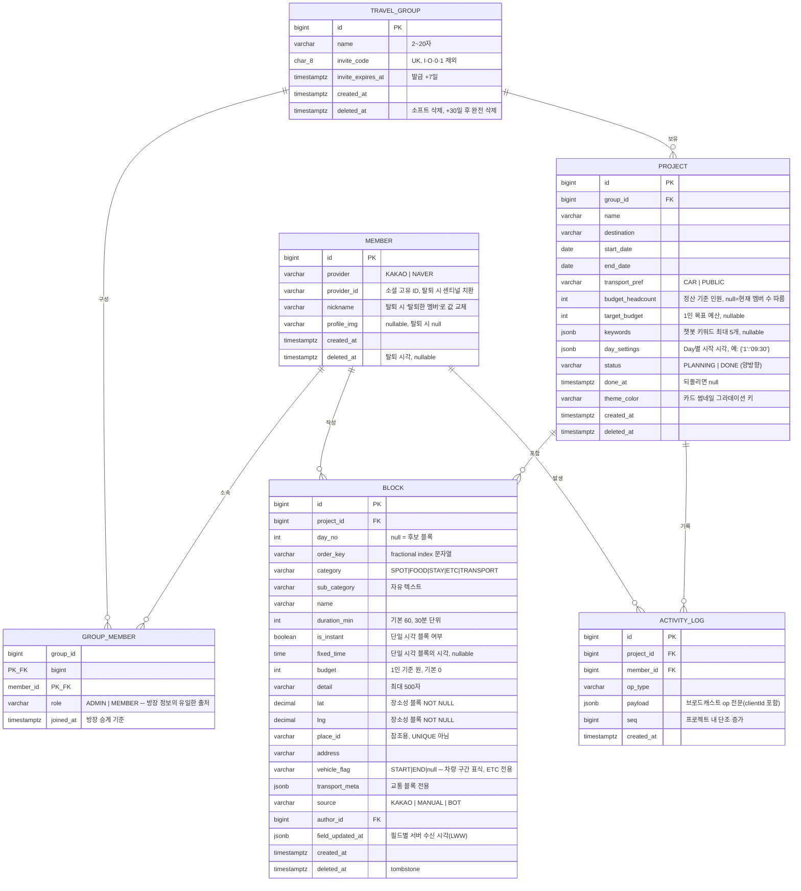

# ERD 설계 문서

> 서비스명: 이음길 (그룹 여행 계획 & 실시간 협업 플랫폼)
> 기준: 백엔드 설계 v3 / 기능명세서 2026-07-16 / 통합 프로토타입
> 작성일: 2026-07-28 — 백엔드 설계 v3 스키마 기준으로 정리
> DB: PostgreSQL(RDS) — JSONB · partial index 활용

---

## 목차

1. [다이어그램](#다이어그램)
2. [엔티티 목록](#엔티티-목록)
3. [엔티티 상세 정의](#엔티티-상세-정의)
4. [관계 요약](#관계-요약)
5. [DB에 저장하지 않는 것](#db에-저장하지-않는-것)

---

## 다이어그램



---

## 엔티티 목록

| 엔티티 | 설명 |
|---|---|
| `MEMBER` | 서비스 회원 (소셜 로그인 기반) |
| `TRAVEL_GROUP` | 여행 그룹 (`group`은 SQL 예약어라 테이블명 변경) |
| `GROUP_MEMBER` | 그룹 멤버 (소속 + 방장 여부) |
| `PROJECT` | 그룹 내 여행 프로젝트 (대시보드 보드 단위) |
| `BLOCK` | 일정 블록 / 후보 블록 (보드의 최소 단위) |
| `ACTIVITY_LOG` | 실시간 동기화 op 저널 (재전송 원본) |

---

## 엔티티 상세 정의

### MEMBER: 서비스 회원
| 컬럼 | 타입 | 제약 | 설명 |
|---|---|---|---|
| id | BIGINT | PK, IDENTITY | DB 내 회원 식별자 |
| provider | VARCHAR(10) | NOT NULL | 소셜 제공자 `KAKAO` / `NAVER` |
| provider_id | VARCHAR(64) | NOT NULL | 소셜 고유 ID. 탈퇴 시 센티널 치환 |
| nickname | VARCHAR(30) | NOT NULL | 표시 이름. 탈퇴 시 `"탈퇴한 멤버"`로 값 교체 |
| profile_img | VARCHAR(512) | NULL | 프로필 이미지 URL. 탈퇴 시 null |
| created_at | TIMESTAMPTZ | NOT NULL, DEFAULT NOW | 가입 시점 |
| deleted_at | TIMESTAMPTZ | NULL | 소프트 삭제(탈퇴) 시각 |

> **UNIQUE KEY: `(provider, provider_id)`** — 카카오/네이버는 별도 계정으로 취급(AUTH-03).
>
> **탈퇴 정책(AUTH-05) — "재가입 = 신규 계정".** 계정 통합·부활은 v1 범위 외.
> - `provider_id` → `WITHDRAWN:{memberId}` 센티널로 치환 (원본 소셜 ID 즉시 파기, 유니크 보장)
> - `nickname` → `"탈퇴한 멤버"`로 값 교체 (NOT NULL 충돌 없음, 블록 작성자 표기 자동 해결)
> - `profile_img` → null, `deleted_at` 기록. 행은 유지(BLOCK.author_id FK 보존)
> - 같은 소셜로 재가입하면 provider_id가 겹치지 않아 새 행 생성 — 충돌·부활 없음

---

### TRAVEL_GROUP: 여행 그룹
| 컬럼 | 타입 | 제약 | 설명 |
|---|---|---|---|
| id | BIGINT | PK, IDENTITY | 그룹 식별자 |
| name | VARCHAR(20) | NOT NULL | 그룹 이름 (2~20자) |
| invite_code | CHAR(8) | UNIQUE, NOT NULL | 초대 코드. 대문자+숫자(I·O·0·1 제외) 랜덤 |
| invite_expires_at | TIMESTAMPTZ | NOT NULL | 초대 코드 만료 (발급 +7일) |
| created_at | TIMESTAMPTZ | NOT NULL, DEFAULT NOW | 생성 시점 |
| deleted_at | TIMESTAMPTZ | NULL | 소프트 삭제 시각 (+30일 후 하드 삭제) |

> **owner_id 컬럼 없음** — 방장 정보는 `GROUP_MEMBER.role='ADMIN'`이 유일한 출처. 같은 사실을 두 곳에 두면 승계 시 한쪽만 갱신되는 버그가 발생.
> 초대 코드 재발급 시 값 교체 = 기존 코드 즉시 무효(GRP-06). 스케줄러가 30일 경과분 하드 삭제(MY-04).

---

### GROUP_MEMBER: 그룹 멤버
| 컬럼 | 타입 | 제약 | 설명 |
|---|---|---|---|
| group_id | BIGINT | PK, FK(TRAVEL_GROUP) | 그룹 식별자 (ON DELETE CASCADE) |
| member_id | BIGINT | PK, FK(MEMBER) | 회원 식별자 (ON DELETE CASCADE) |
| role | VARCHAR(10) | NOT NULL | `ADMIN` / `MEMBER` — 방장 정보의 유일한 출처 |
| joined_at | TIMESTAMPTZ | NOT NULL, DEFAULT NOW | 가입 시점 (방장 승계 기준) |

> **PK: `(group_id, member_id)`** 복합키. 정원(최대 10명) 검증은 서비스 레이어에서 count 후 삽입, 동시 가입 경합은 그룹 행 `SELECT ... FOR UPDATE`로 방지.
>
> **ADMIN 1인 불변식을 DB에서 강제** — partial unique index:
> ```sql
> CREATE UNIQUE INDEX uk_group_admin ON group_member (group_id) WHERE role = 'ADMIN';
> ```
> 승계 로직(GRP-09: 방장 탈퇴 → joined_at 최소 멤버로 위임)에 버그가 있어도 ADMIN 0명/2명 상태를 DB가 차단. 방출/탈퇴 = 행 삭제(블록은 author_id로 유지).

---

### PROJECT: 여행 프로젝트
| 컬럼 | 타입 | 제약 | 설명 |
|---|---|---|---|
| id | BIGINT | PK, IDENTITY | 프로젝트 식별자 |
| group_id | BIGINT | FK(TRAVEL_GROUP) NOT NULL | 소속 그룹 (ON DELETE CASCADE) |
| name | VARCHAR(100) | NOT NULL | 프로젝트 이름 |
| destination | VARCHAR(100) | NULL | 여행지 |
| start_date | DATE | NULL | 시작일 |
| end_date | DATE | NULL | 종료일 |
| transport_pref | VARCHAR(10) | NULL | 선호 이동수단 `CAR` / `PUBLIC` |
| budget_headcount | INT | NULL | 정산 기준 인원. null=조회 시점 멤버 수 따름 |
| target_budget | INT | NULL | 1인 목표 예산 |
| keywords | JSONB | NULL | 챗봇 키워드 (최대 5개) |
| day_settings | JSONB | NULL | Day별 시작 시각. 예: `{"1":"09:30"}` |
| status | VARCHAR(10) | NOT NULL | `PLANNING` / `DONE` (양방향 전환) |
| done_at | TIMESTAMPTZ | NULL | 완료 시각 (되돌리면 null) |
| theme_color | VARCHAR(30) | NULL | 카드 썸네일 그라데이션 키 |
| created_at | TIMESTAMPTZ | NOT NULL, DEFAULT NOW | 생성 시점 |
| deleted_at | TIMESTAMPTZ | NULL | 소프트 삭제 시각 |

> **`budget_headcount`**: 생성 폼의 "여행 인원" 입력을 초기값으로 사용. null이면 조회 시점 그룹 멤버 수로 계산, 직접 지정 후에는 멤버 수 변동에 자동 연동하지 않음(BGT-03).
> **`day_settings`(DAY-03 저장처)**: 키 없는 Day는 기본 `09:00`(희소 저장). `jsonb_set`으로 해당 Day 키만 부분 갱신. 기간 축소 시 사라진 Day 키 제거.
> **`status`**: 양방향 전환. DONE이어도 쓰기 거부 로직을 두지 않음(NFR-05). 인덱스 `(group_id, status)`.

---

### BLOCK: 일정 / 후보 블록
| 컬럼 | 타입 | 제약 | 설명 |
|---|---|---|---|
| id | BIGINT | PK, IDENTITY | 블록 식별자 |
| project_id | BIGINT | FK(PROJECT) NOT NULL | 소속 프로젝트 (ON DELETE CASCADE) |
| day_no | INT | NULL | Day 번호. **NULL = 후보 블록(POOL)** |
| order_key | VARCHAR(255) | NOT NULL | fractional index 문자열 (체인 정렬) |
| category | VARCHAR(20) | NOT NULL | `SPOT` / `FOOD` / `STAY` / `ETC` / `TRANSPORT` |
| sub_category | VARCHAR(50) | NULL | 자유 텍스트 소분류 |
| name | VARCHAR(255) | NOT NULL | 블록 이름 |
| duration_min | INT | NOT NULL, DEFAULT 60 | 소요 시간 (30분 단위) |
| is_instant | BOOLEAN | NOT NULL, DEFAULT FALSE | 단일 시각 블록 여부 |
| fixed_time | TIME | NULL | 단일 시각 블록의 시각 |
| budget | INT | NOT NULL, DEFAULT 0 | 1인 기준 예산(원) |
| detail | VARCHAR(500) | NULL | 세부 내용 (최대 500자) |
| lat | DECIMAL(10,7) | NULL | 위도. **장소성 블록은 NOT NULL** |
| lng | DECIMAL(10,7) | NULL | 경도. **장소성 블록은 NOT NULL** |
| place_id | VARCHAR(64) | NULL | 카카오 장소 ID (참조용, UNIQUE 아님) |
| address | VARCHAR(255) | NULL | 주소 |
| vehicle_flag | VARCHAR(10) | NULL | `START` / `END` / null — 차량 구간 표식, ETC 전용 |
| transport_meta | JSONB | NULL | 교통 블록 전용 메타 |
| source | VARCHAR(10) | NOT NULL | 생성 출처 `KAKAO` / `MANUAL` / `BOT` |
| author_id | BIGINT | FK(MEMBER) NOT NULL | 작성자 (ON DELETE RESTRICT — 탈퇴는 소프트) |
| field_updated_at | JSONB | NOT NULL, DEFAULT '{}' | 필드별 서버 수신 시각 (LWW) |
| created_at | TIMESTAMPTZ | NOT NULL, DEFAULT NOW | 생성 시점 |
| deleted_at | TIMESTAMPTZ | NULL | tombstone (소프트 삭제) |

> **체인 조회는 partial index** (tombstone 필터가 항상 붙으므로):
> ```sql
> CREATE INDEX ix_block_chain ON block (project_id, day_no, order_key) WHERE deleted_at IS NULL;
> ```
> **정렬은 항상 `ORDER BY order_key, id`** — 동시 삽입으로 order_key가 같을 수 있어 id로 tie-break.
> **`budget`은 1인 기준 반올림 정수로 통일** — 총액 항목은 FE가 정산 인원으로 나눠 저장(안건 ④).
> **`vehicle_flag`**: ETC 카테고리에서만 노출. 역할은 "수단 선택의 기본값 제안"까지만 — 판정 결과를 계산에 직접 쓰지 않아 이동·삭제되어도 기존 교통 블록 오염 없음.
> **`transport_meta` 예시**:
> ```json
> {
>   "mode": "TRAIN",
>   "trainType": "KTX",
>   "depName": "서울역", "arrName": "부산역",
>   "depTime": "09:07", "arrTime": "11:52",
>   "depLat": 37.55, "depLng": 126.97,
>   "arrLat": 35.11, "arrLng": 129.04,
>   "routeMode": "SUBWAY",
>   "estimated": true,
>   "fare": 59900,
>   "fareConfidence": "CONFIRMED"
> }
> ```
> `estimated`(시간 추정)와 `fareConfidence`(요금 신뢰도 `CONFIRMED`/`ESTIMATE`)는 별개 축.
> **`field_updated_at` 예시**: `{"budget":"2026-08-01T10:22:31.512Z"}` — LWW 대상 필드는 `jsonb_set`으로 원자적 부분 갱신.
> **시각 표현 한계(v1 스코프 아웃)**: `fixed_time`·`depTime`/`arrTime`은 날짜 없는 시각이라 익일 도착(심야 이동) 미표현.

---

### ACTIVITY_LOG: 실시간 동기화 op 저널
| 컬럼 | 타입 | 제약 | 설명 |
|---|---|---|---|
| id | BIGINT | PK, IDENTITY | 로그 식별자 |
| project_id | BIGINT | FK(PROJECT) NOT NULL | 소속 프로젝트 (ON DELETE CASCADE) |
| member_id | BIGINT | FK(MEMBER) NOT NULL | op 발생 주체 |
| op_type | VARCHAR(40) | NOT NULL | op 종류 (예: `BLOCK_CREATED`) |
| payload | JSONB | NOT NULL | 브로드캐스트 op 전문 (clientId 포함) |
| seq | BIGINT | NOT NULL | 프로젝트 내 단조 증가 시퀀스 |
| created_at | TIMESTAMPTZ | NOT NULL, DEFAULT NOW | 기록 시점 |

> **UNIQUE KEY: `(project_id, seq)`**.
> **payload에는 브로드캐스트한 op 전문을 그대로 저장** — "재전송 = 저장된 걸 그대로 쏜다"가 구조적으로 보장. 재연결 시 `WHERE project_id=? AND seq > :lastSeq ORDER BY seq`로 유실분 재전송(NFR-01).
> **seq 채번**: Redis `INCR project:{id}:seq` + 채번~브로드캐스트 구간을 프로젝트 단위 락으로 직렬화 + 앱 기동 시 `max(seq)` 리시드.

---

## 관계 요약

```
MEMBER ──< GROUP_MEMBER >── TRAVEL_GROUP
TRAVEL_GROUP ──< PROJECT ──< BLOCK
PROJECT ──< ACTIVITY_LOG
MEMBER ──< BLOCK (author_id)
MEMBER ──< ACTIVITY_LOG (member_id)
```

- `MEMBER` ↔ `TRAVEL_GROUP`은 `GROUP_MEMBER`로 다대다. 방장 여부는 `GROUP_MEMBER.role`.
- `TRAVEL_GROUP` 1 : N `PROJECT`, `PROJECT` 1 : N `BLOCK`.
- `BLOCK.author_id`, `ACTIVITY_LOG.member_id`는 `MEMBER` 참조 (탈퇴는 소프트 삭제라 FK 유지).

---

## DB에 저장하지 않는 것

명세서 설계 원칙에 따라 아래는 RDB가 아닌 Redis/메모리에 둔다.

| 항목 | 저장소 | 비고 |
|---|---|---|
| Refresh 토큰 / 로그아웃 블랙리스트 | Redis | `refresh:{memberId}`, TTL 기반 |
| 접속 · 커서 · 편집 중 배지 (presence) | Redis · 메모리 | TTL 기반(PRS) |
| 세부 내용 텍스트 편집 락 | Redis `SET NX` | TTL 30초(OI-04) |
| seq 채번 카운터 | Redis `INCR` | 기동 시 `max(seq)` 리시드 |
| 블록 시작 시각 · Day 종료 시각 · 예산 합계 | 클라이언트 파생 계산 | `day_settings`(기본 09:00) 기점(BLK-08) |
